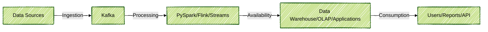
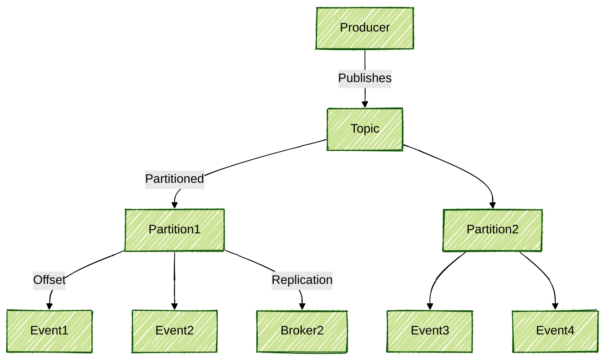
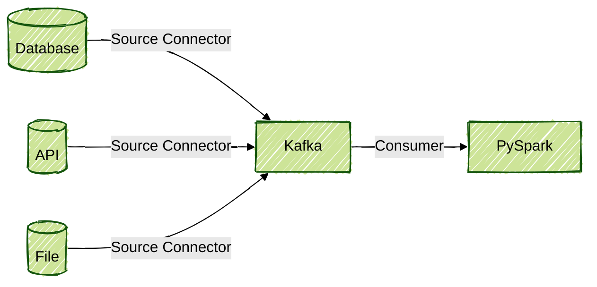
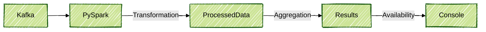
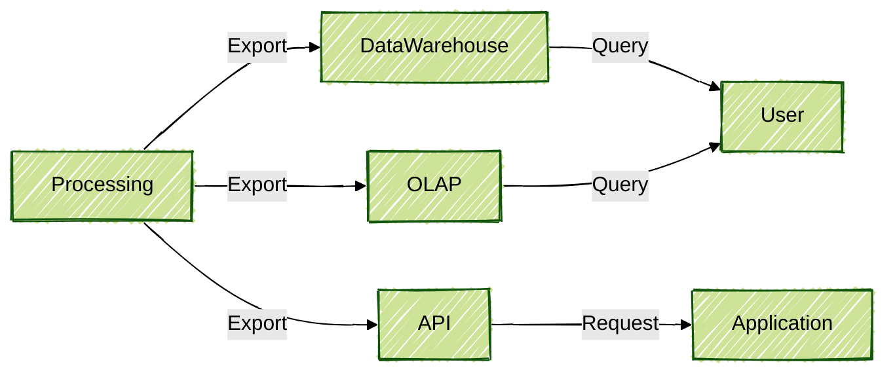
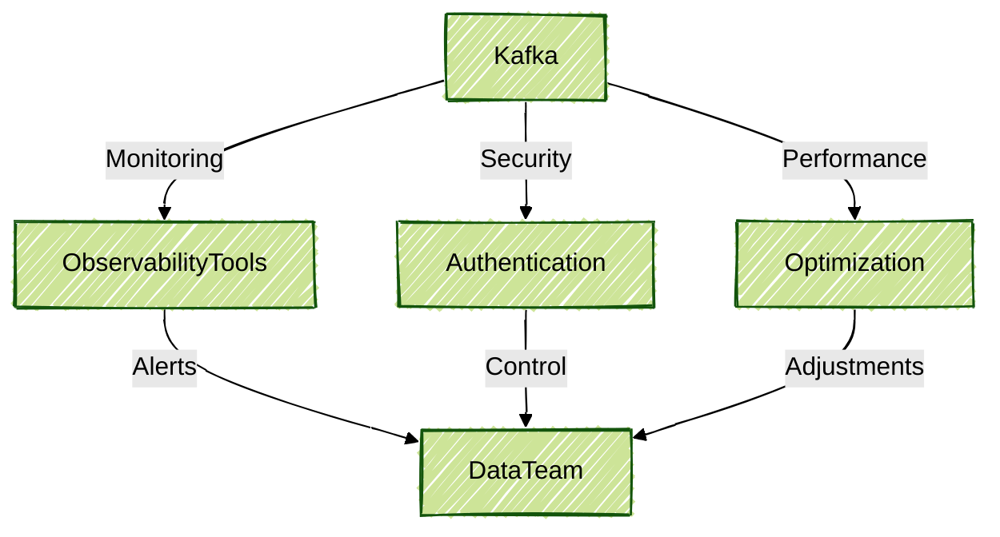

# Apache Kafka

Hello! Welcome to this repository containing resources and content related to Apache Kafka. The repository has been carefully structured to provide a comprehensive understanding of the main concepts, tools, and practices in the streaming data domain, with a particular emphasis on Apache Kafka.

## Content Structure

The content is organized into five major stages, each representing a fundamental step of the data pipeline:

1. **Internal Fundamentals**
2. **Data Ingestion**
3. **Data Processing**
4. **Availability and Consumption**
5. **Advanced Strategies and Best Practices**

Each stage is detailed below, with concepts explained and practical examples provided, including PySpark code to facilitate daily application.

---

## Data Pipeline with Apache Kafka



---

## 1. Internal Fundamentals

In this stage, essential concepts required to understand the Big Data and messaging ecosystem are covered:

- **Big Data:** Volume, variety, and velocity of data.
- **Messaging:** Asynchronous communication between systems.
- **Streaming Platforms:** Continuous real-time data processing.

### Apache Kafka Concepts

- **Topics:** Channels where messages are published.
- **Partitions:** Division of topics for parallelism and scalability.
- **Offset:** Unique identifier for each message within a partition.
- **Log Compaction:** Message retention mechanism.
- **Partition Leadership and Replication:** High availability and fault tolerance are ensured.

**Official Resources:**
- [Apache Kafka Documentation](https://kafka.apache.org/documentation/)
- [Kafka Introduction](https://kafka.apache.org/intro)
- [Kafka Concepts](https://kafka.apache.org/documentation/#concepts)



---

## 2. Data Ingestion

This stage focuses on how data is brought into Kafka using various formats and tools.



### Ingestion Examples with PySpark

```python
from pyspark.sql import SparkSession

# Initializing Spark session
spark = SparkSession.builder \
    .appName("KafkaIngestionExample") \
    .getOrCreate()

# Reading data from a Kafka topic
df = spark.readStream \
    .format("kafka") \
    .option("kafka.bootstrap.servers", "localhost:9092") \
    .option("subscribe", "my-topic") \
    .load()

# Converting message value to string
df = df.selectExpr("CAST(value AS STRING)")

df.writeStream \
    .format("console") \
    .start() \
    .awaitTermination()
```

- **Kafka Connect:** Integration of Kafka with various data sources and destinations is enabled by this tool.
- **Data Formats:** JSON, Avro, Parquet, etc.

**Official Resources:**
- [Kafka Connect Documentation](https://kafka.apache.org/documentation/#connect)
- [PySpark Structured Streaming + Kafka](https://spark.apache.org/docs/latest/structured-streaming-kafka-integration.html)
- [Kafka Connectors Hub](https://www.confluent.io/hub/)

---

## 3. Data Processing

Once data is ingested, it is processed to generate value.



### Processing Examples with PySpark

```python
from pyspark.sql.functions import from_json, col
from pyspark.sql.types import StructType, StringType

# Defining the data schema
schema = StructType().add("user", StringType()).add("action", StringType())

# Transforming JSON value into structured columns
processed_data = df.select(from_json(col("value"), schema).alias("data")).select("data.*")

# Example of aggregation
result = processed_data.groupBy("action").count()

# Writing the result to the console
result.writeStream \
    .outputMode("complete") \
    .format("console") \
    .start() \
    .awaitTermination()
```

- **Event Processing:** Real-time event processing is performed.
- **Tools:** Python, SQL, Flink, Kafka Streams, KSQL DB, ByteWax, Apache Spark.

**Official Resources:**
- [Kafka Streams Documentation](https://kafka.apache.org/documentation/streams/)
- [Apache Flink Documentation](https://nightlies.apache.org/flink/flink-docs-master/)
- [KSQL DB Documentation](https://ksqldb.io/)
- [PySpark Structured Streaming](https://spark.apache.org/docs/latest/structured-streaming-programming-guide.html)

---

## 4. Availability and Consumption

After processing, data is made available for consumption by other systems.



- **Kafka Consumer:** Processed data is read.
- **Data Export:** Kafka Connect is used to send data to databases, data warehouses, and other destinations.
- **OLAP and MDW Systems:** Analytical systems are integrated.
- **Data Virtualization:** Data is accessed without physical movement.

### Consumption Example with PySpark

```python
# Reading processed data from another Kafka topic
df_consumption = spark.readStream \
    .format("kafka") \
    .option("kafka.bootstrap.servers", "localhost:9092") \
    .option("subscribe", "processed-topic") \
    .load()

df_consumption.selectExpr("CAST(value AS STRING)").writeStream \
    .format("console") \
    .start() \
    .awaitTermination()
```

**Official Resources:**
- [Kafka Consumer Documentation](https://kafka.apache.org/documentation/#consumerapi)
- [Kafka Connect Sinks](https://kafka.apache.org/documentation/#connect)
- [Data Virtualization Overview](https://www.ibm.com/topics/data-virtualization)

---

## 5. Advanced Strategies and Best Practices

Practical and advanced strategies to optimize Kafka usage are covered in this stage:



- **Illumination and Development:** Techniques to facilitate daily work are presented.
- **Reference Architectures:** Examples of robust and scalable architectures are provided.
- **Tips and Tools:** Resources to increase productivity and reliability are shared.

**Official Resources:**
- [Kafka Monitoring & Management](https://kafka.apache.org/documentation/#monitoring)
- [Kafka Security Documentation](https://kafka.apache.org/documentation/#security)
- [Kafka Performance Tuning](https://kafka.apache.org/documentation/#performance)
- [Confluent Reference Architectures](https://docs.confluent.io/platform/current/platform-architecture.html)

---

**More Resources:**
- [Kafka Tutorials](https://kafka.apache.org/documentation/#gettingStarted)
- [Confluent Kafka Tutorials](https://developer.confluent.io/learn-kafka/)
- [Apache Kafka GitHub](https://github.com/apache/kafka)
