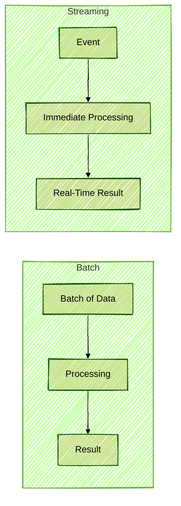
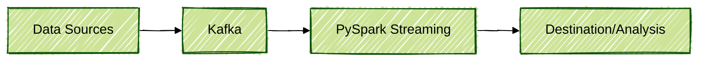
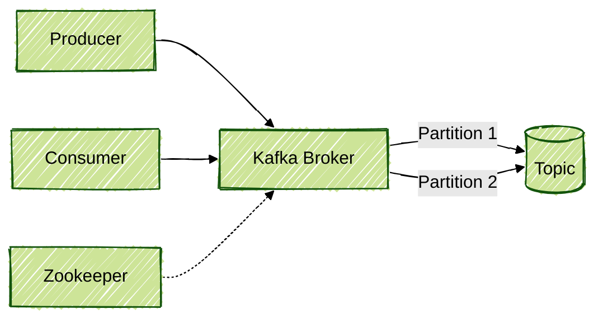
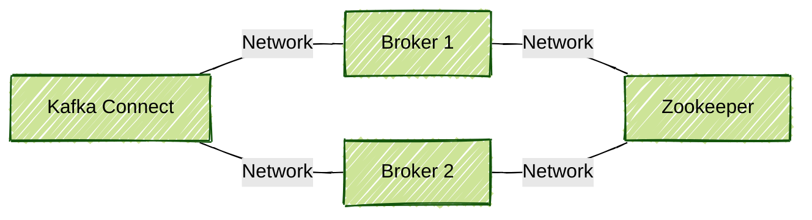
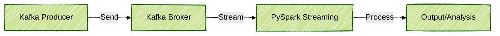

# Fundamentals of Apache Kafka and Introduction to Streaming Data Processing

## Introduction

Welcome to the personal repository on Apache Kafka fundamentals. In this document, essential concepts regarding data, messaging, events, distributed architecture, and especially how Apache Kafka has become a leading platform for real-time data processing are detailed. Practical examples using PySpark are provided to illustrate how these concepts can be applied in daily scenarios. This content and resources have been created and curated by me, and are not part of any course or training.

---

## 1. Evolution of Data: Volume, Variety, and Velocity

### The 3 Vs of Data

The world of data has been rapidly evolved, and three major challenges known as the "3 Vs" have been addressed:

- **Volume**: Massive amounts of data are generated (from gigabytes to petabytes).
- **Variety**: Diversity of sources and formats (relational databases, NoSQL, APIs, files).
- **Velocity**: The need to process and react to data in real time.

#### Practical Example: Batch vs. Streaming Data Processing

```python
# A simple example of batch data reading with PySpark
from pyspark.sql import SparkSession

spark = SparkSession.builder.appName("BatchExample").getOrCreate()
df = spark.read.csv("data.csv", header=True, inferSchema=True)
df.show()
```

In batch processing, data is processed at defined intervals (minutes, hours). In streaming, the goal is to process data as soon as it arrives, with millisecond latency.

#### Diagram: Batch vs Streaming



---

## 2. The Importance of Velocity

Products and libraries have been created by companies such as Netflix, Spotify, Airbnb, and LinkedIn to handle large volumes of real-time data:

- **Netflix**: Apache Iceberg
- **Spotify**: SEO (Beam library)
- **Airbnb**: Airflow
- **LinkedIn**: Kafka

Currently, the focus has been placed on **velocity**: processing, analyzing, and reacting to events in milliseconds.

#### Practical Example: Reading Streaming Data with PySpark

```python
# Example of reading streaming data with PySpark
from pyspark.sql.types import StructType, StringType, IntegerType

schema = StructType() \
    .add("id", IntegerType()) \
    .add("message", StringType())

stream_df = spark.readStream \
    .schema(schema) \
    .json("path/to/streaming/directory")

query = stream_df.writeStream \
    .outputMode("append") \
    .format("console") \
    .start()

query.awaitTermination()
```

#### Diagram: Streaming Pipeline



---

## 3. Messaging: From Queues to Topics

### Messaging Systems

Traditionally, systems such as RabbitMQ have been used with queues for message exchange between producers and consumers. Messages are consumed and removed from the queue.

#### Evolution to Topics

Kafka has introduced the concept of **topics**: instead of a transient queue, messages are persisted on disk and can be consumed by multiple consumers at different times.

- **Producer**: Messages are sent to a topic.
- **Consumer**: Messages are read from the topic.
- **Broker**: The server stores topic data.
- **Partitions**: Each topic is divided into partitions for scalability.

#### Practical Example: Simulating Data Production and Consumption with PySpark

```python
# Simulating data production (writing to a monitored directory)
import time
import json

for i in range(10):
    with open(f"path/to/streaming/directory/message_{i}.json", "w") as f:
        json.dump({"id": i, "message": f"Message {i}"}, f)
    time.sleep(1)
```

#### Diagram: Producer, Broker, and Consumer


---

## 4. Apache Kafka: Architecture and Components

### Main Components

- **Broker**: Responsible for storing and managing topics and partitions.
- **Producer API**: Interface for applications to send data to Kafka.
- **Consumer API**: Interface for applications to read data from Kafka.
- **Kafka Connect**: Facilitates integration with databases and other systems without code.
- **Kafka Streams**: Library for real-time data processing directly within Kafka.
- **Zookeeper**: Manages metadata and cluster coordination (being replaced by KRaft).

#### Practical Example: Consuming Data from Kafka with PySpark

```python
# Example of reading data from Kafka with PySpark
df_kafka = spark.readStream \
    .format("kafka") \
    .option("kafka.bootstrap.servers", "localhost:9092") \
    .option("subscribe", "example_topic") \
    .load()

df_values = df_kafka.selectExpr("CAST(value AS STRING)")
query = df_values.writeStream \
    .outputMode("append") \
    .format("console") \
    .start()

query.awaitTermination()
```

#### Diagram: Kafka Architecture



---

## 5. Use Cases: Real-Time Fraud Detection

One of the main uses of streaming has been real-time fraud detection, where responses must be almost instantaneous.

#### Practical Example: Processing Fraud Events

```python
from pyspark.sql.functions import col

# Assuming the input data has a 'value' field
frauds = stream_df.filter(col("value") > 10000)  # Example of a simple rule

frauds.writeStream \
    .outputMode("append") \
    .format("console") \
    .start()
```

#### Diagram: Fraud Detection


---

## 6. Kafka Implementations and Distributions

- **Open Source (Vanilla)**: Manual installation of Apache Kafka.
- **Confluent Cloud**: Managed Kafka in the cloud, with additional features.
- **AWS MSK**: Kafka managed by AWS.
- **Azure HDInsight**: Kafka managed by Microsoft (version awareness required).
- **Strimzi**: Kafka on Kubernetes, ideal for flexible and scalable environments.

---

## 7. Architectural Considerations

- **Component separation**: Brokers, Zookeeper, and Connect should run on separate servers to avoid performance and availability issues.
- **Persistence**: Proper disk selection (SSD for intensive workloads) is recommended.
- **Management**: Managed solutions reduce administration needs but may incur higher costs.

#### Diagram: Component Separation



---

## 8. Complete Example: Streaming Pipeline with PySpark and Kafka

```python
# 1. Producing data to Kafka (example in pure Python)
from kafka import KafkaProducer
import json

producer = KafkaProducer(bootstrap_servers='localhost:9092',
                         value_serializer=lambda v: json.dumps(v).encode('utf-8'))

for i in range(100):
    producer.send('example_topic', {'id': i, 'message': f'Message {i}'})

producer.flush()

# 2. Consuming and processing real-time data with PySpark
from pyspark.sql import SparkSession
from pyspark.sql.functions import from_json, col
from pyspark.sql.types import StructType, StringType, IntegerType

spark = SparkSession.builder.appName("KafkaStreaming").getOrCreate()

schema = StructType() \
    .add("id", IntegerType()) \
    .add("message", StringType())

df_kafka = spark.readStream \
    .format("kafka") \
    .option("kafka.bootstrap.servers", "localhost:9092") \
    .option("subscribe", "example_topic") \
    .load()

df_values = df_kafka.selectExpr("CAST(value AS STRING) as json") \
    .select(from_json(col("json"), schema).alias("data")) \
    .select("data.*")

# Example processing: filter messages with even id
df_filtered = df_values.filter(col("id") % 2 == 0)

query = df_filtered.writeStream \
    .outputMode("append") \
    .format("console") \
    .start()

query.awaitTermination()
```

#### Diagram: Complete Pipeline



---

## 9. Conclusion

Apache Kafka has revolutionized real-time data processing, enabling scalable, resilient architectures integrated with various technologies. When combined with tools such as PySpark, robust pipelines for ingestion, processing, and analysis of streaming data can be built.

**Final tips:**
- Participation in communities and events (Kafka Summit, Airflow Summit, etc.) is encouraged.
- Practice with real examples is recommended.
- Cost-benefit analysis between open source and managed solutions should always be performed.

---

## References

- [Official Apache Kafka Documentation](https://kafka.apache.org/documentation/)
- [PySpark Structured Streaming Guide](https://spark.apache.org/docs/latest/structured-streaming-programming-guide.html)
- [Confluent Kafka Documentation](https://docs.confluent.io/platform/current/index.html)
- [Strimzi Kafka on Kubernetes](https://strimzi.io/docs/)
- [AWS MSK Documentation](https://docs.aws.amazon.com/msk/)
- [Azure HDInsight Kafka Documentation](https://learn.microsoft.com/en-us/azure/hdinsight/kafka/apache-kafka-introduction)

---

*This document is part of a personal repository created and maintained by me, containing content and resources related to streaming data processing with a focus on Apache Kafka. For further study and support, references to official documentation and resources have been included.*
