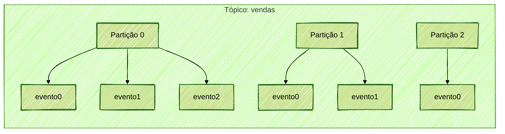
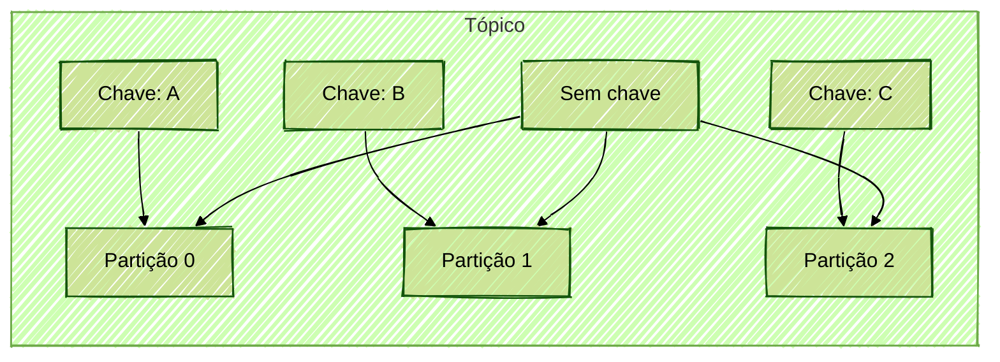
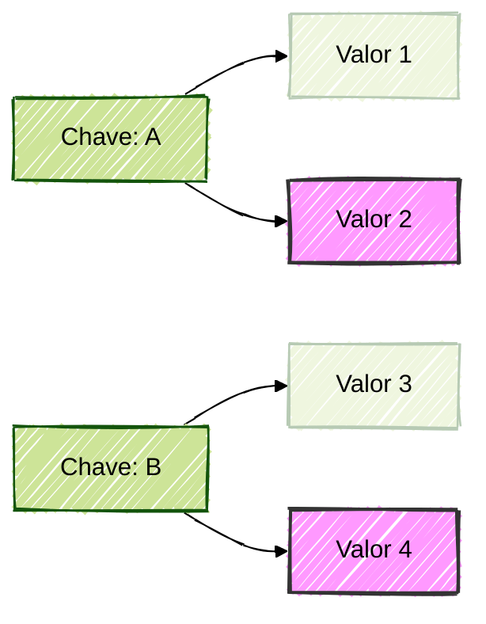
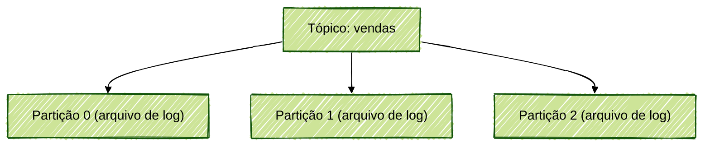
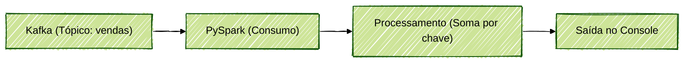

# Fundamentos do Apache Kafka - Parte 2

Este documento detalha os principais conceitos do Apache Kafka, abordando tópicos como estrutura de logs, tópicos, partições, offsets, replicação, log compaction e exemplos práticos. Ao final, apresentamos exemplos de integração com PySpark para ilustrar como consumir e processar dados do Kafka.

---

## Estrutura de Log no Kafka

O Kafka utiliza uma estrutura de log distribuído para armazenar eventos (mensagens). Cada evento é gravado de forma sequencial em partições, garantindo alta performance e escalabilidade.

- **Log de Banco**: Estrutura tradicional, com índice e persistência.
- **Log Distribuído**: Utiliza partições, offsets e replicação para garantir disponibilidade e tolerância a falhas.

### Componentes Principais

- **Tópico**: Representa um canal lógico onde eventos são publicados.
- **Partição**: Subdivisão do tópico, permitindo paralelismo e escalabilidade.
- **Offset**: Posição sequencial de cada evento dentro de uma partição.

#### Exemplo Visual

```
Tópico: vendas
Partições: 0, 1, 2

Partição 0: [evento0, evento1, evento2]
Partição 1: [evento0, evento1]
Partição 2: [evento0]
```

Cada evento possui um offset único dentro da partição, mas offsets podem se repetir entre partições diferentes.

#### Diagrama: Estrutura de Tópico e Partições



---

## Funcionamento do Offset

O offset é fundamental para o controle de leitura dos consumidores. Cada consumidor armazena o último offset lido, evitando leituras duplicadas.

- **Offset é sequencial e imutável**.
- **Não existe índice tradicional**: O controle é feito apenas pelo offset.

### Exemplo de Controle de Offset

```python
# Exemplo de leitura de mensagens do Kafka com PySpark
from pyspark.sql import SparkSession

spark = SparkSession.builder \
    .appName("KafkaOffsetExample") \
    .getOrCreate()

df = spark.readStream \
    .format("kafka") \
    .option("kafka.bootstrap.servers", "localhost:9092") \
    .option("subscribe", "vendas") \
    .option("startingOffsets", "earliest") \
    .load()

df.selectExpr("CAST(key AS STRING)", "CAST(value AS STRING)", "offset") \
    .writeStream \
    .format("console") \
    .start() \
    .awaitTermination()
```

#### Diagrama: Consumo de Mensagens e Controle de Offset


---

## Chave e Valor nas Mensagens

Cada mensagem pode conter uma chave (`key`) e um valor (`value`). A chave é opcional, mas quando utilizada, garante que todas as mensagens com a mesma chave sejam direcionadas para a mesma partição.

- **Sem chave**: Distribuição balanceada entre partições.
- **Com chave**: Garantia de ordenação por chave dentro da partição.

#### Diagrama: Distribuição de Mensagens por Chave



---

## Log Compaction

O log compaction é uma configuração que permite manter apenas o último valor de cada chave em um tópico, útil para cenários de atualização de estado.

- **Necessário definir chave**.
- **Kafka mantém apenas o registro mais recente para cada chave**.

### Exemplo de Configuração

```bash
kafka-topics.sh --create \
  --bootstrap-server localhost:9092 \
  --replication-factor 3 \
  --partitions 6 \
  --topic vendas_compactado \
  --config cleanup.policy=compact
```

### Exemplo PySpark: Consumindo Tópico Compactado

```python
df = spark.readStream \
    .format("kafka") \
    .option("kafka.bootstrap.servers", "localhost:9092") \
    .option("subscribe", "vendas_compactado") \
    .load()

# Apenas o último valor de cada chave estará disponível após o compaction
df.selectExpr("CAST(key AS STRING)", "CAST(value AS STRING)") \
    .writeStream \
    .format("console") \
    .start() \
    .awaitTermination()
```

#### Diagrama: Log Compaction



---

## Replicação e Tolerância a Falhas

O Kafka replica partições entre múltiplos brokers para garantir alta disponibilidade.

- **Fator de replicação**: Número de cópias de cada partição.
- **Líder e followers**: Cada partição tem um broker líder responsável por receber e replicar dados para os followers.
- **Failover automático**: Em caso de falha do líder, um follower é eleito automaticamente como novo líder.

### Exemplo de Criação de Tópico com Replicação

```bash
kafka-topics.sh --create \
  --bootstrap-server localhost:9092 \
  --replication-factor 3 \
  --partitions 6 \
  --topic vendas_replicado
```

#### Diagrama: Replicação de Partições

```mermaid
---
config:
  theme: forest
  look: handDrawn
---
flowchart LR
    subgraph Broker 1
        P0L[Partição 0 (Líder)]
    end
    subgraph Broker 2
        P0F1[Partição 0 (Follower)]
    end
    subgraph Broker 3
        P0F2[Partição 0 (Follower)]
    end
    P0L -- Replicação --> P0F1
    P0L -- Replicação --> P0F2
```

---

## Armazenamento Físico

Os dados do Kafka são armazenados em disco, organizados por tópicos e partições. Cada partição corresponde a um arquivo de log físico.

- **Alta performance**: Escrita sequencial em disco.
- **Zero copy**: Kafka utiliza técnicas para otimizar leitura e escrita.

#### Diagrama: Organização Física dos Dados



---

## Integração com PySpark

O PySpark permite consumir, processar e gravar dados do Kafka de forma distribuída.

### Exemplo Completo: Consumo, Processamento e Escrita

```python
from pyspark.sql import SparkSession
from pyspark.sql.functions import expr

spark = SparkSession.builder \
    .appName("KafkaIntegrationExample") \
    .getOrCreate()

# Consome dados do Kafka
df = spark.readStream \
    .format("kafka") \
    .option("kafka.bootstrap.servers", "localhost:9092") \
    .option("subscribe", "vendas") \
    .option("startingOffsets", "earliest") \
    .load()

# Processa os dados (exemplo: converte valor para inteiro e soma por chave)
df_parsed = df.selectExpr("CAST(key AS STRING)", "CAST(value AS STRING) as valor") \
    .withColumn("valor", expr("cast(valor as int)"))

df_agg = df_parsed.groupBy("key").sum("valor")

# Escreve o resultado no console
df_agg.writeStream \
    .outputMode("complete") \
    .format("console") \
    .start() \
    .awaitTermination()
```

#### Diagrama: Pipeline de Integração PySpark + Kafka



---

## Boas Práticas

- **Defina o número de partições conforme a necessidade de paralelismo**.
- **Utilize log compaction apenas quando necessário**.
- **Monitore o fator de replicação para garantir disponibilidade sem comprometer a performance**.
- **Evite alterar configurações avançadas sem testes**.

---

## Conclusão

O Apache Kafka é uma plataforma robusta para processamento de streams de dados, oferecendo alta disponibilidade, escalabilidade e integração com ferramentas como PySpark. Compreender os conceitos de tópicos, partições, offsets, replicação e log compaction é essencial para construir pipelines de dados eficientes e resilientes.