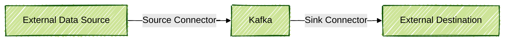
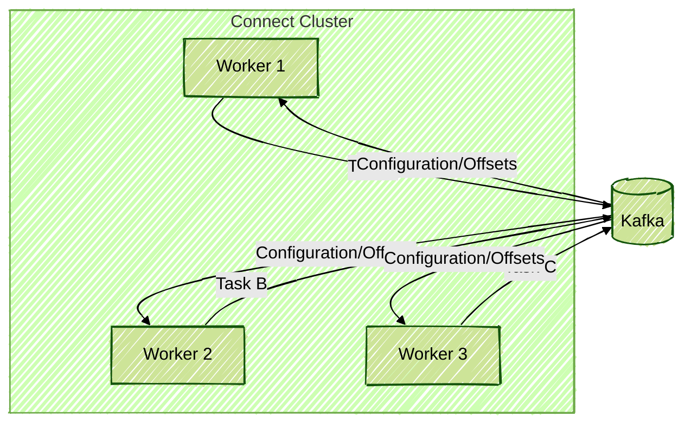
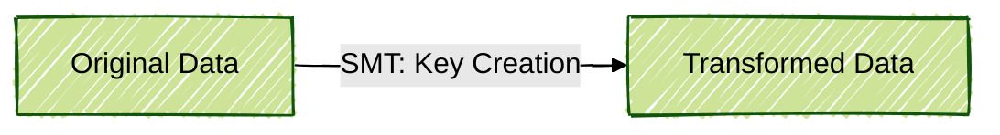
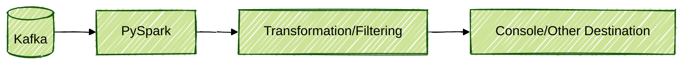

# Data Ingestion with Apache Kafka Connect

## Introduction

In this document, the operation of **Kafka Connect** is detailed. This framework, which is open source, is used for integration, ingestion, and export of data within the Apache Kafka ecosystem. The concepts, architecture, best practices, and practical examples are explained, including code snippets in PySpark to illustrate how data ingested via Kafka Connect can be consumed and processed.  
*This document was created by Amanda and is part of a personal repository focused on streaming data processes, especially with Apache Kafka. It is not a course or training material.*

---

## What is Kafka Connect?

**Kafka Connect** is described as an integration framework that enables external data sources (databases, file systems, APIs, etc.) to be connected to Kafka, as well as exporting data from Kafka to other systems. The concept of **connectors** is used, which are of two types:

- **Source Connector**: Data is read from an external source and published to Kafka.
- **Sink Connector**: Data is read from Kafka and sent to an external destination.

Connectors are plugins that encapsulate all integration logic, making the process declarative and eliminating the need for custom programming.

### Connector Flow Diagram



---

## Kafka Connect Architecture

The architecture of Kafka Connect is composed of:

- **Connect Cluster**: One or more nodes (workers) that run the connectors.
- **Workers**: Nodes that execute connector tasks.
- **Tasks**: Parallel execution units of a connector.
- **Configurations**: Declarative files (JSON or properties) that define how the connector will operate.

### Deployment Modes

- **Standalone**: Used for development, runs on a single worker and stores offsets/configurations locally.
- **Distributed**: Recommended for production, allows high availability and distribution of tasks among multiple workers, storing offsets/configurations in Kafka internal topics.

### Architecture Diagram



---

## Anatomy of a Connector

A connector is defined by:

- **Connector Class**: Defines the type (e.g., JDBC, MongoDB, Elasticsearch).
- **Transformations (SMT)**: Allows small transformations on data in transit (e.g., cast, field drop, masking).
- **Converter**: Defines the serialization format (JSON, Avro, Protobuf).
- **Specific Configurations**: Parameters such as connection, authentication, tables, etc.

Example of a simplified configuration (JSON):

```json
{
        "name": "my-jdbc-connector",
        "config": {
                "connector.class": "io.confluent.connect.jdbc.JdbcSourceConnector",
                "connection.url": "jdbc:postgresql://localhost:5432/mydatabase",
                "connection.user": "user",
                "connection.password": "password",
                "table.whitelist": "my_table",
                "mode": "incrementing",
                "incrementing.column.name": "id",
                "topic.prefix": "my_topic_",
                "key.converter": "org.apache.kafka.connect.storage.StringConverter",
                "value.converter": "io.confluent.connect.avro.AvroConverter",
                "value.converter.schema.registry.url": "http://localhost:8081"
        }
}
```

---

## Best Practices with Connectors

- **Versioning**: Updated versions of connectors should always be used, and compatibility with source/destination systems should be validated.
- **Testing Environment**: Connectors should be tested in isolated environments before being promoted to production.
- **Dependency Management**: All required JARs must be present in the Connect plugin folder.
- **Monitoring**: Commands and APIs should be used to monitor connector status, tasks, and logs.
- **Documentation**: Official connector documentation should always be consulted to understand limitations and supported configurations.

---

## Examples of Popular Connectors

### JDBC Source Connector

Data ingestion from relational databases (Postgres, MySQL, SQL Server, Oracle, etc.) via JDBC is enabled.

- **Operation Modes**:
        - `incrementing`: An incremental column (e.g., auto-increment ID) is used.
        - `timestamp+incrementing`: Timestamp and incremental column are used to detect new records.
        - `bulk`: The entire table is read at each execution.

**Attention**: Gaps in incremental columns may cause data loss. Views or artificial sequential columns are recommended if necessary.

### MongoDB Source Connector

The official MongoDB connector uses Change Streams to capture changes in collections.

- Complete or partial documents can be published.
- CDC (Change Data Capture) configurations are supported.

### Debezium CDC Connector

Specialized in CDC for databases such as MySQL, Postgres, SQL Server, Oracle, etc.

- Transaction logs (binlog, replication, CDC) must be enabled.
- Insert, update, and delete operations can be captured.
- Tombstone configuration for deleted records is supported.

---

## Simple Transformations (SMT)

SMTs allow small transformations on data, such as:

- **Create key from field**
- **Mask sensitive fields**
- **Type conversion**

Example of SMT configuration to create a key from the `id` field:

```json
"transforms": "CreateKey",
"transforms.CreateKey.type": "org.apache.kafka.connect.transforms.ValueToKey",
"transforms.CreateKey.fields": "id"
```

### SMT Transformation Diagram



---

## Data Consumption and Processing with PySpark

After data is ingested into Kafka, frameworks such as **PySpark** are commonly used to process this data in real time or batch.

### Example: Consuming Data from Kafka with PySpark

```python
from pyspark.sql import SparkSession
from pyspark.sql.functions import from_json, col
from pyspark.sql.types import StructType, StringType, IntegerType

# Create Spark session
spark = SparkSession.builder \
                .appName("KafkaConnectIngestion") \
                .getOrCreate()

# Define data schema (adjust as needed)
schema = StructType() \
                .add("id", IntegerType()) \
                .add("name", StringType()) \
                .add("email", StringType())

# Read data from Kafka
df = spark.readStream \
                .format("kafka") \
                .option("kafka.bootstrap.servers", "localhost:9092") \
                .option("subscribe", "my_topic_mytable") \
                .load()

# Convert value from binary to string and apply schema
json_df = df.selectExpr("CAST(value AS STRING) as json") \
                .select(from_json(col("json"), schema).alias("data")) \
                .select("data.*")

# Example transformation: filter records
filtered_df = json_df.filter(col("email").endswith("@company.com"))

# Write result to console (or other sink)
query = filtered_df.writeStream \
                .outputMode("append") \
                .format("console") \
                .start()

query.awaitTermination()
```

### PySpark Consumption Flow



---

## Final Tips

- **SMT**: Should be used sparingly, only for simple transformations.
- **Schema Registry**: Should be used to ensure schema compatibility (especially with Avro/Protobuf).
- **CDC**: Limitations of the connector and source database should be understood.
- **Monitoring**: Tasks, offsets, and connector status should always be monitored.
- **Testing**: Exhaustive testing should be performed before moving to production.

---

## References

- [Official Kafka Connect Documentation](https://kafka.apache.org/documentation/#connect)
- [Confluent Hub](https://www.confluent.io/hub/)
- [Stream Reactor](https://github.com/lensesio/stream-reactor)
- [Debezium Documentation](https://debezium.io/documentation/)
- [Apache Kafka Documentation](https://kafka.apache.org/documentation/)
- [PySpark Documentation](https://spark.apache.org/docs/latest/api/python/)
- [Kafka Connect SMT Reference](https://docs.confluent.io/platform/current/connect/transforms/index.html)

---

## Conclusion

Kafka Connect is presented as a powerful tool for data ingestion and integration within the Kafka ecosystem, facilitating the construction of robust and scalable data pipelines. When combined with processing tools such as PySpark, efficient and declarative streaming analytics and real-time data integration solutions can be created.  
*This document was authored by Amanda and is part of a personal repository of resources and content related to streaming data processes, with a focus on Apache Kafka. For further study and support, official documentation and resources are referenced throughout this document.*
