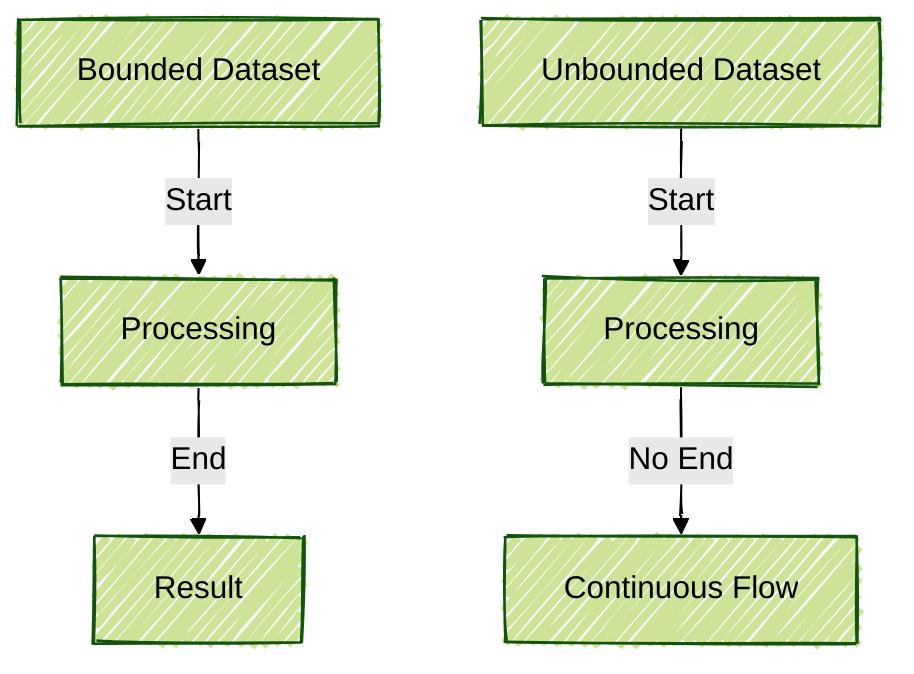
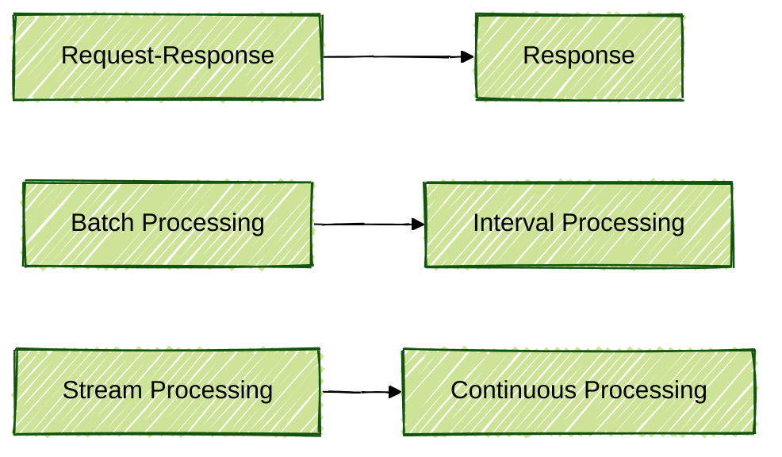
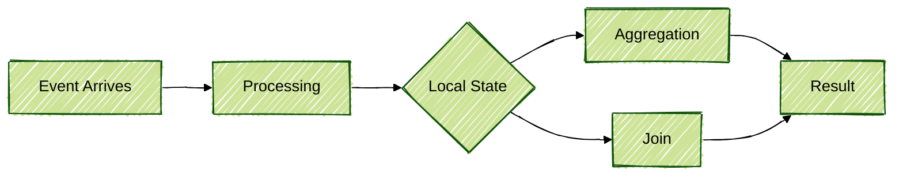
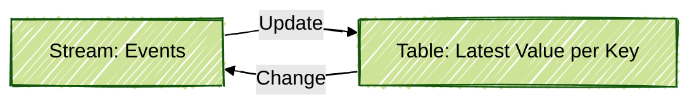
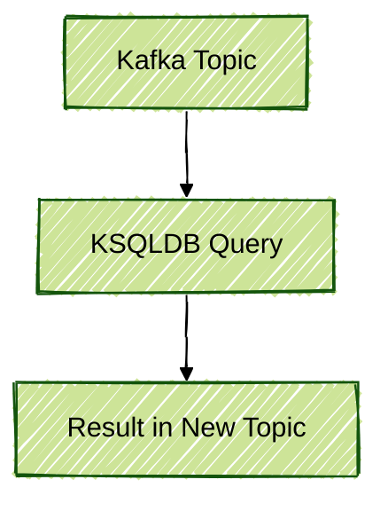

# Lesson 03: Data Processing with Apache Kafka

## Introduction

This document was created by Amanda and is part of a personal repository containing resources and notes about streaming data processing, with a focus on Apache Kafka. The concepts and examples presented here are intended for individual study and reference, not as part of any official course or training. For further information, official documentation and resources are referenced throughout.

---

## What Is Event Processing and Streaming?

Apache Kafka is widely recognized for its ability to store and transmit streaming data. Data ingestion using Kafka Connect, Producers, and best practices for reading from various sources, including databases, has been previously explored. Simple transformations (SMT) in Connect have also been covered.

Now, more complex transformations are addressed, where data is modified and new data is generated from received events. The goal is to enrich raw data, making it useful for decision-making.

### Why Is Streaming Processing Important?

Previously, companies focused on groups of customers to create products. Today, the focus has shifted to individualization: products are created for each customer. Streaming processing enables this personalization, as it allows reactions to events in real time and rapid adaptation of strategies.

For further reading: [Apache Kafka Documentation - Introduction](https://kafka.apache.org/documentation/)

---

## Fundamental Concepts of Streaming

### Event Stream

An **event stream** is defined as an ordered sequence of events over time, each with its own timestamp. In Kafka, each event can be read multiple times, allowing historical data replay.

#### Bounded vs. Unbounded

- **Bounded Dataset**: A dataset with a defined start and end (e.g., batch processing).
- **Unbounded Dataset**: A continuous flow of data, with no defined end (e.g., streaming).



### Immutability of Events

In streaming, events are considered **immutable**. Updates or deletions generate new events, which are only added to the flow. No direct update/delete is performed on already processed events.


### Event Replay

Kafka allows event replay, meaning old events can be reread from any partition offset, unlike traditional messaging systems.

Reference: [Kafka Consumer - Reading Data](https://kafka.apache.org/documentation/#consumerapi)

---

## Types of Processing

- **Request-Response**: Traditional client-server communication.
- **Stream Processing**: Continuous event processing, with possibilities for joins, aggregations, and real-time transformations.
- **Batch Processing**: Processing large volumes of data at defined intervals.



The focus is placed on **stream processing**, always seeking low latency and real-time data transformation.

Reference: [Kafka Streams Overview](https://kafka.apache.org/documentation/streams/)

---

## Micro-Batching vs. Real-Time Streaming

Tools such as Spark Streaming utilize the concept of **micro-batch** (e.g., processing events every 100ms). Although not absolute "real-time," it is considered real-time for most use cases.


### Practical Example with PySpark

```python
from pyspark.sql import SparkSession
from pyspark.sql.functions import from_json, col
from pyspark.sql.types import StructType, StringType, IntegerType

# Spark session creation
spark = SparkSession.builder \
    .appName("KafkaStreamingExample") \
    .getOrCreate()

# Data schema definition
schema = StructType() \
    .add("client_id", StringType()) \
    .add("purchase", IntegerType())

# Reading the stream from Kafka
df = spark.readStream \
    .format("kafka") \
    .option("kafka.bootstrap.servers", "localhost:9092") \
    .option("subscribe", "purchases") \
    .load()

# Value conversion to string and JSON parsing
json_df = df.selectExpr("CAST(value AS STRING) as json") \
    .select(from_json(col("json"), schema).alias("data")) \
    .select("data.*")

# Aggregation: average purchases per client
agg_df = json_df.groupBy("client_id").avg("purchase")

# Writing the result to console (could be another Kafka topic, database, etc.)
query = agg_df.writeStream \
    .outputMode("complete") \
    .format("console") \
    .start()

query.awaitTermination()
```

Reference: [Spark Structured Streaming + Kafka Integration](https://spark.apache.org/docs/latest/structured-streaming-kafka-integration.html)

---

## State in Streaming Processing

When processing streams, many operations require **state maintenance** (e.g., aggregations, joins). State can be stored locally (e.g., RocksDB) or externally (e.g., Cassandra), but local storage is recommended to ensure low latency.



Reference: [Kafka Streams - State Stores](https://kafka.apache.org/documentation/streams/developer-guide/state.html)

---

## Stream-Table Duality

In stream processing, a duality exists between **stream** (sequence of events) and **table** (snapshot of the latest value per key). Tools such as Kafka Streams and Flink allow conversion between these concepts.



Reference: [Kafka Streams - Stream-Table Duality](https://kafka.apache.org/documentation/streams/core-concepts#duality)

---

## Kafka Streams

**Kafka Streams** is a Java/Scala library for real-time data processing directly in Kafka. Data can be consumed, transformed, aggregated, and produced back to Kafka, with state maintained locally via RocksDB.

### Anatomy of Processing with Kafka Streams


### Example Pipeline in PySpark (Simulating Similar Logic)

```python
from pyspark.sql.functions import expr

# Assuming json_df from the previous example

# Filter only purchases above a certain value
filtered_df = json_df.filter(col("purchase") > 100)

# Write to another Kafka topic
filtered_df.selectExpr("to_json(struct(*)) AS value") \
    .writeStream \
    .format("kafka") \
    .option("kafka.bootstrap.servers", "localhost:9092") \
    .option("topic", "filtered_purchases") \
    .start()
```

Reference: [Kafka Streams Developer Guide](https://kafka.apache.org/documentation/streams/developer-guide/)

---

## KSQLDB

**ksqldb** enables stream processing in Kafka using SQL, making it easier for data teams who prefer declarative abstractions. While easy to use, it has flexibility limitations and is gradually being replaced by other solutions in the ecosystem.



Reference: [ksqldb Documentation](https://ksqldb.io/)

---

## Final Considerations

- **Streaming processing** is essential for modern applications, enabling fast and personalized reactions.
- **State** should preferably be maintained locally to ensure performance.
- Tools such as **Kafka Streams**, **Flink**, and **Spark Structured Streaming** are the main options for real-time data processing.
- The use of **PySpark** allows streaming concepts to be applied in Python, facilitating integration with the data ecosystem.

For further study, consult the official documentation:
- [Apache Kafka Documentation](https://kafka.apache.org/documentation/)
- [Kafka Streams Documentation](https://kafka.apache.org/documentation/streams/)
- [Spark Structured Streaming Documentation](https://spark.apache.org/docs/latest/structured-streaming-programming-guide.html)
- [ksqldb Documentation](https://ksqldb.io/)

---

## Next Steps

In the next document, practical examples of streaming processing will be explored, including joins, time windows, and integration with different sources and destinations. All content is authored by Amanda and intended for personal reference and continuous learning.