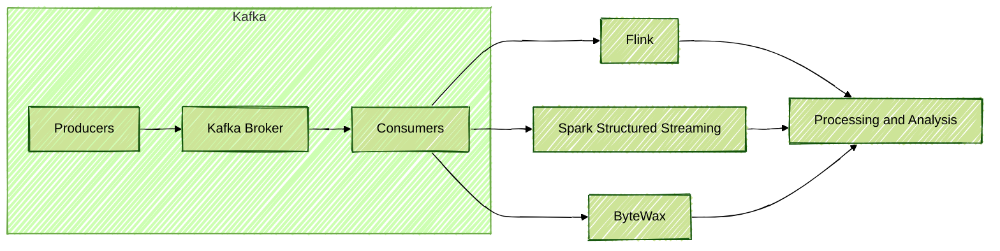
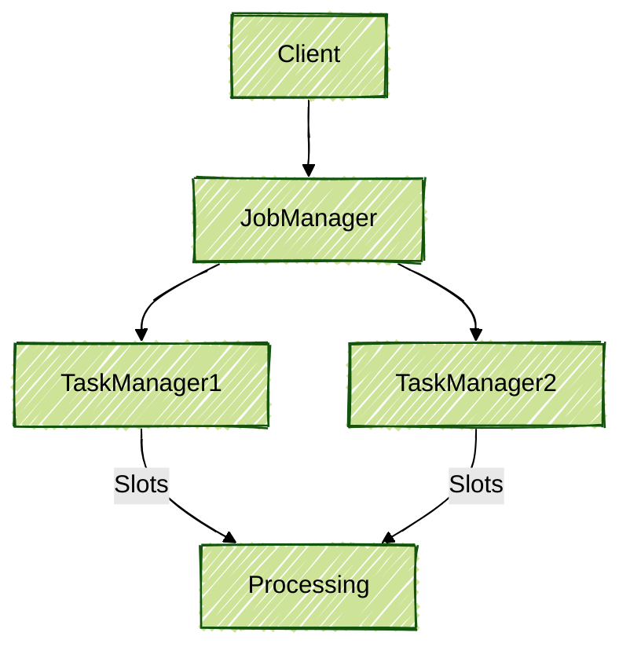

# Data Streaming Processing with Apache Kafka: A Detailed Overview

This document has been created by Amanda Mendes as part of a personal repository containing content and resources related to streaming data processing, with a focus on Apache Kafka. It is not a course or training material, but rather a collection of personal notes and examples. Official documentation and resources have been referenced throughout to support further study.

---

## 1. Introduction to Streaming Processing

Streaming data processing has been enabled to analyze, transform, and act on data in real time as it is generated. In the modern data ecosystem, Apache Kafka has been recognized as one of the main platforms for ingestion and transport of real-time events.

### Main Streaming Processing Tools

- **Apache Flink:** A robust platform for stream processing, supporting high- and low-level APIs, SQL, and integration with various systems. [Official documentation](https://nightlies.apache.org/flink/flink-docs-master/)
- **Apache Spark Structured Streaming:** An evolution of Spark Streaming, based on micro-batches, with DataFrame APIs and native integration with Kafka. [Official documentation](https://spark.apache.org/docs/latest/structured-streaming-programming-guide.html)
- **ByteWax:** A Python library for stream processing, simple and efficient, supporting window operators, mapping, and Kafka integration. [Official documentation](https://www.bytewax.io/docs/)

#### Flow Diagram: Streaming Ecosystem



---

## 2. Apache Flink: Architecture and Application

### 2.1. Flink Architecture

Flink has been composed of three main components:

- **Client:** Jobs are sent to the cluster.
- **JobManager:** Job execution is managed.
- **TaskManager (Worker):** Distributed tasks are executed.

Processing has been distributed across multiple slots, ensuring high performance and scalability.

#### Flink Architecture Diagram



### 2.2. Flink APIs

- **DataSet API:** Batch processing is performed.
- **DataStream API:** Streaming processing is performed.
- **Table API and SQL:** Declarative processing with SQL is enabled.

### 2.3. Usage Example: PyFlink with Kafka

```python
from pyflink.table import EnvironmentSettings, TableEnvironment

# Environment configuration
env_settings = EnvironmentSettings.in_streaming_mode()
table_env = TableEnvironment.create(env_settings)

# Kafka Source table definition
table_env.execute_sql("""
CREATE TABLE stock_data (
    symbol STRING,
    shares INT,
    price DOUBLE,
    transaction_date TIMESTAMP(3),
    WATERMARK FOR transaction_date AS transaction_date - INTERVAL '5' SECOND
) WITH (
    'connector' = 'kafka',
    'topic' = 'stock_topic',
    'properties.bootstrap.servers' = 'localhost:9092',
    'format' = 'json',
    'scan.startup.mode' = 'latest-offset'
)
""")

# SQL query for 1-hour window aggregation
result = table_env.sql_query("""
SELECT
    symbol,
    TUMBLE_START(transaction_date, INTERVAL '1' HOUR) as window_start,
    SUM(shares) as total_shares,
    AVG(price) as avg_price
FROM stock_data
GROUP BY symbol, TUMBLE(transaction_date, INTERVAL '1' HOUR)
""")

# Result output (for local example purposes)
table_env.to_pandas(result).head()
```

Reference: [Apache Flink Table API & SQL](https://nightlies.apache.org/flink/flink-docs-master/docs/dev/table/)

---

## 3. Apache Spark Structured Streaming

Spark Structured Streaming has operated with micro-batches, processing data in small batches with low latency (typically 100ms). DataFrames have been used, and direct integration with Kafka has been supported.

#### Micro-Batch Diagram in Spark


### 3.1. Usage Example: PySpark Structured Streaming

```python
from pyspark.sql import SparkSession
from pyspark.sql.functions import from_json, col, window
from pyspark.sql.types import StructType, StringType, IntegerType, DoubleType, TimestampType

# Spark session initialization
spark = SparkSession.builder.appName("KafkaSparkStreaming").getOrCreate()

# Data schema
schema = StructType() \
    .add("symbol", StringType()) \
    .add("shares", IntegerType()) \
    .add("price", DoubleType()) \
    .add("transaction_date", TimestampType())

# Kafka stream reading
df = spark.readStream \
    .format("kafka") \
    .option("kafka.bootstrap.servers", "localhost:9092") \
    .option("subscribe", "stock_topic") \
    .load()

# Conversion and field selection
json_df = df.select(from_json(col("value").cast("string"), schema).alias("data")).select("data.*")

# 1-hour window aggregation
agg_df = json_df.groupBy(
    window(col("transaction_date"), "1 hour"),
    col("symbol")
).agg(
    {"shares": "sum", "price": "avg"}
)

# Console output (can be Kafka, Delta, etc.)
query = agg_df.writeStream \
    .outputMode("update") \
    .format("console") \
    .start()

query.awaitTermination()
```

Reference: [Spark Structured Streaming Guide](https://spark.apache.org/docs/latest/structured-streaming-programming-guide.html)

---

## 4. ByteWax: Simple Processing in Python

ByteWax has been used as a Python library for stream processing, ideal for simple applications and rapid prototyping.

#### ByteWax Flow Diagram


### 4.1. Usage Example: ByteWax

```python
from bytewax.dataflow import Dataflow
from bytewax.inputs import KafkaInputConfig
from bytewax.outputs import KafkaOutputConfig

def process(record):
    # Example processing: filter transactions above 10,000
    data = record.value
    if data["transaction_value"] > 10000:
        return data
    return None

flow = Dataflow()
flow.input("input", KafkaInputConfig("localhost:9092", "stock_topic"))
flow.map(process)
flow.output("output", KafkaOutputConfig("localhost:9092", "filtered_stock_topic"))
```

Reference: [ByteWax Documentation](https://www.bytewax.io/docs/)

---

## 5. Design Patterns in Streaming Processing

### 5.1. Simple Event Processing

Simple event processing, such as filtering and direct mapping, has been performed.

### 5.2. Stateful Processing

Aggregations, joins, and operations dependent on state have been performed, using State Stores (Flink, Spark, ByteWax).

### 5.3. Multiphase Processing

Multiple processing phases have been enabled, each in a different Kafka topic, allowing reactive and scalable pipelines.

### 5.4. Stream-Table Join

Joins between streams and tables have been performed, common in data enrichment scenarios.

### 5.5. Out-of-Sequence Handling

Out-of-order event handling has been performed, using windows and tolerance for late arrivals.

#### Multiphase Pipeline Diagram


References:
- [Kafka Streams Design Patterns](https://kafka.apache.org/documentation/streams/developer-guide/dsl-api.html)
- [Flink Patterns](https://nightlies.apache.org/flink/flink-docs-master/docs/dev/datastream/overview/)

---

## 6. Usage Recommendations

- **Flink:** Recommended for enterprise cases, high performance, multiple topics, and advanced SQL.
- **Spark Structured Streaming:** Recommended for integration with Delta Lake, analytical pipelines, and hybrid batch/streaming processing.
- **ByteWax:** Recommended for rapid prototyping, pure Python applications, and simple cases.

---

## 7. Conclusion

The streaming processing ecosystem has evolved rapidly, offering multiple options for different needs. Apache Kafka, together with frameworks such as Flink, Spark, and ByteWax, has enabled the construction of robust, scalable, and reactive pipelines to meet modern real-time data demands.

For further study, official documentation and resources have been referenced throughout this repository.

---
