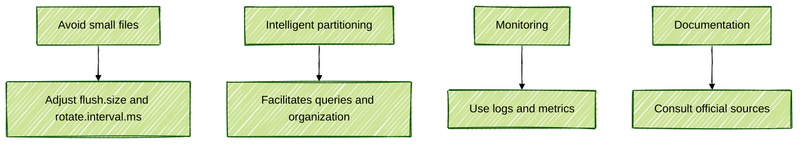

# Data Delivery with Apache Kafka: A Detailed Approach

## Introduction

In this document, a detailed exploration of data delivery using Apache Kafka is presented, ranging from fundamental concepts to practical examples with PySpark code. This content has been created as part of a personal repository, authored by me, and is not associated with any course or training. The objective is to provide a comprehensive resource for connecting, transforming, and delivering data in modern streaming data pipelines, utilizing connectors, formats, and real-time analytics tools.

---

## Overview of the Data Delivery Pipeline

```mermaid
---
config:
  theme: forest
  look: handDrawn
---
flowchart TD
    A[Kafka Topic] -->|Source Connector| B[Kafka Connect]
    B -->|Transformation (SMT)| C[Data Conversion]
    C -->|Sink Connector| D{Destination}
    D -->|JDBC| E[Relational Database]
    D -->|S3| F[S3 Bucket]
    D -->|Pinot| G[Apache Pinot]
```

---

## Anatomy of Kafka Connect

**Kafka Connect** is described as a robust framework for integrating external systems with Kafka, either for ingestion (Source) or delivery (Sink/Sync) of data. The basic structure of a connector consists of:

- **Connector**: Responsible for connecting to the external system.
- **Transformation (SMT - Single Message Transform)**: Allows messages to be modified in transit.
- **Conversion**: Adapts the data format (JSON, Avro, Protobuf, String, etc).

> **Tip:** Official connector documentation should always be consulted to understand capabilities and limitations.


---

## Main Sink Connectors

### JDBC Sink Connector

Data from Kafka can be delivered to relational databases (PostgreSQL, SQL Server, MySQL, etc). Configurations supported include:

- **pk.mode**: Defines how the primary key is generated (for example, from the value or key of the message).
- **auto.create** and **auto.evolve**: Control automatic creation and evolution of tables.
- **CDC (Change Data Capture)**: Enables reflection of delete and update operations in the destination.

**Configuration example:**

```json
{
    "name": "jdbc-sink-connector",
    "config": {
        "connector.class": "io.confluent.connect.jdbc.JdbcSinkConnector",
        "topics": "my-topic",
        "connection.url": "jdbc:postgresql://host:5432/db",
        "auto.create": "true",
        "auto.evolve": "true",
        "pk.mode": "record_value",
        "insert.mode": "upsert"
    }
}
```

---

### AWS S3 Sink Connector

Data from Kafka can be delivered to S3 buckets (or compatible ones, such as MinIO), in formats like Parquet, JSON, or Avro. Proper configuration of partitioning and file size is essential to avoid the "small files" problem.

**Important configurations:**

- `flush.size`: Number of records per file.
- `rotate.interval.ms`: Time interval for file rotation.
- `partitioner.class`: Defines the partitioning strategy (by time, field, etc).

**Configuration example:**

```json
{
    "name": "s3-sink-connector",
    "config": {
        "connector.class": "io.confluent.connect.s3.S3SinkConnector",
        "topics": "my-topic",
        "s3.bucket.name": "my-bucket",
        "s3.region": "us-east-1",
        "flush.size": "10000",
        "rotate.interval.ms": "600000",
        "format.class": "io.confluent.connect.s3.format.parquet.ParquetFormat",
        "partitioner.class": "io.confluent.connect.storage.partitioner.TimeBasedPartitioner",
        "path.format": "'year'=YYYY/'month'=MM/'day'=dd/'hour'=HH",
        "locale": "en_US",
        "timezone": "America/New_York"
    }
}
```

---

## Practical Examples with PySpark

### Reading Parquet Data from S3

After data has been delivered to S3, PySpark is commonly used for processing.

```python
from pyspark.sql import SparkSession

spark = SparkSession.builder \
        .appName("Read S3 Parquet") \
        .getOrCreate()

# Reading Parquet files partitioned by year, month, day, and hour
df = spark.read.parquet("s3a://my-bucket/year=*/month=*/day=*/hour=*")

df.printSchema()
df.show(5)
```

### Processing and Writing Data to Kafka

Data can be processed and results sent to a Kafka topic:

```python
from pyspark.sql.functions import to_json, struct

# Assuming df is the processed DataFrame
df_to_kafka = df.select(to_json(struct("*")).alias("value"))

df_to_kafka.write \
        .format("kafka") \
        .option("kafka.bootstrap.servers", "localhost:9092") \
        .option("topic", "processed-topic") \
        .save()
```

---

## User-Facing Analytics with Apache Pinot

**Apache Pinot** is described as a columnar analytical solution, optimized for real-time queries with high concurrency and low latency. Data is consumed directly from Kafka, with no need for intermediate connectors.

### Pinot Ingestion and Query Diagram


### Pinot Features

- **Real-time and offline ingestion**
- **Timestamp-based segmentation**
- **Pluggable indexes (e.g., StarTree Index)**
- **High performance for analytical queries**

### Pinot Schema and Table Example

```json
// Example schema
{
    "schemaName": "stock_transactions",
    "dimensionFieldSpecs": [
        {"name": "id", "dataType": "INT"},
        {"name": "user_id", "dataType": "INT"},
        {"name": "symbol", "dataType": "STRING"}
    ],
    "metricFieldSpecs": [
        {"name": "shares", "dataType": "INT"},
        {"name": "purchase", "dataType": "DOUBLE"}
    ],
    "dateTimeFieldSpecs": [
        {
            "name": "update_at",
            "dataType": "LONG",
            "format": "1:MILLISECONDS:EPOCH",
            "granularity": "1:DAYS"
        }
    ]
}
```

```json
// Example table
{
    "tableName": "stock_transactions",
    "tableType": "REALTIME",
    "segmentsConfig": {
        "timeColumnName": "update_at",
        "retentionTimeUnit": "DAYS",
        "retentionTimeValue": "60"
    },
    "tableIndexConfig": {
        "invertedIndexColumns": ["id"]
    },
    "ingestionConfig": {
        "streamIngestionConfig": {
            "streamConfigMaps": [
                {
                    "streamType": "kafka",
                    "stream.kafka.topic.name": "processed-topic",
                    "stream.kafka.broker.list": "localhost:9092",
                    "stream.kafka.consumer.type": "lowlevel",
                    "stream.kafka.decoder.class.name": "org.apache.pinot.plugin.stream.kafka.KafkaJSONMessageDecoder"
                }
            ]
        }
    }
}
```

---

## Real-Time Analytical Queries

With Pinot, high-performance SQL analytical queries can be executed, even with millions of records.

**Query example:**

```sql
SELECT symbol, SUM(shares) AS total_shares
FROM stock_transactions
WHERE update_at >= 1680000000000
GROUP BY symbol
ORDER BY total_shares DESC
LIMIT 10;
```

---

## Best Practices and Tips



- **Small files should be avoided**: Adjust `flush.size` and `rotate.interval.ms` in S3 connectors.
- **Intelligent partitioning should be used**: Partitioning by time or field facilitates queries and organization.
- **Monitoring should be performed**: Logs and metrics from connectors and Kafka Connect should be utilized.
- **Official documentation should always be consulted**: For connectors and tools.

---

## Conclusion

Data delivery with Apache Kafka, Sink connectors, and tools such as PySpark and Apache Pinot enables the construction of robust, scalable, and real-time analytical data pipelines. With the practices and examples presented in this personal repository, created by me, modern streaming analytics solutions can be implemented.

---

## References

- [Kafka Connect Documentation](https://kafka.apache.org/documentation/#connect)
- [Confluent S3 Sink Connector](https://docs.confluent.io/kafka-connect-s3/current/index.html)
- [Apache Pinot Documentation](https://docs.pinot.apache.org/)
- [PySpark Documentation](https://spark.apache.org/docs/latest/api/python/)
- [Apache Kafka Documentation](https://kafka.apache.org/documentation/)
- [Apache Spark Structured Streaming](https://spark.apache.org/docs/latest/structured-streaming-programming-guide.html)
- [Apache Pinot Streaming Ingestion](https://docs.pinot.apache.org/basics/data-ingestion/streaming)
- [Kafka Connect SMT Reference](https://docs.confluent.io/platform/current/connect/transforms/index.html)
