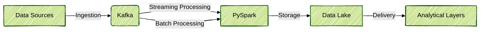
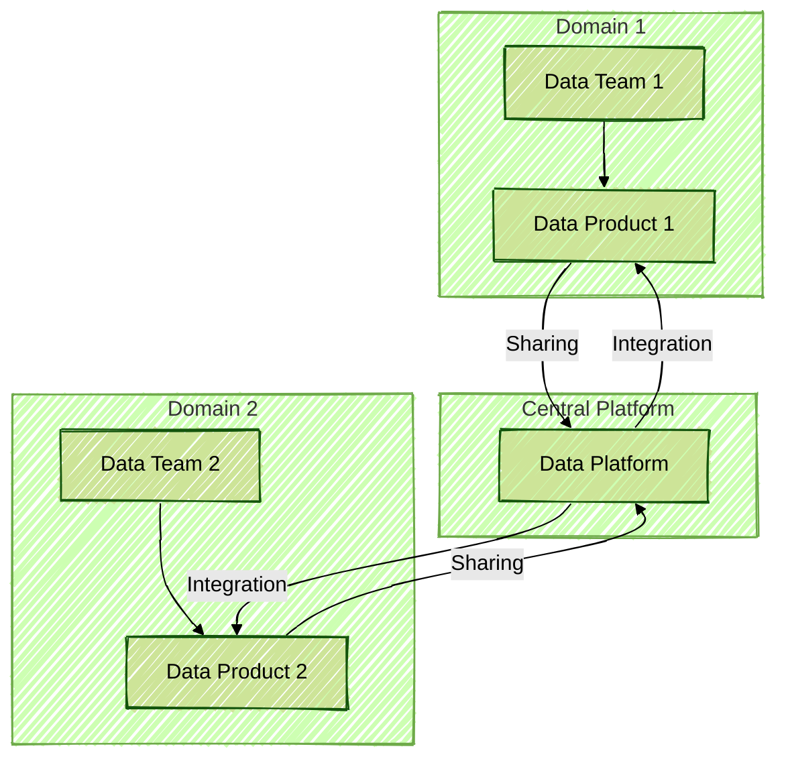
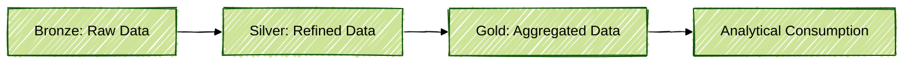
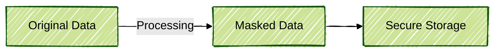
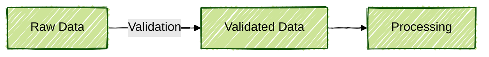
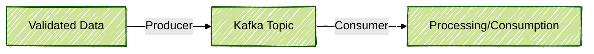

# Modern Data Architectures: Concepts, Practices, and Examples with PySpark

This document has been created by Amanda and is part of a personal repository focused on streaming data processing, with emphasis on Apache Kafka. The content and resources presented here are intended for personal study and reference, and are not part of any course or training. Official documentation and resources are referenced throughout to support further exploration.

---

## 1. Kappa Architecture

The Kappa architecture was designed by Jay Kreps, creator of Apache Kafka, with the goal of simplifying data processing by unifying batch and streaming ingestion into a single flow.

### Kappa Flow Diagram



### Characteristics

- **Unified Ingestion:** All data sources (files, databases, applications) are sent to a single central point, typically Kafka.
- **Flexible Processing:** Data is processed in real time (streaming) or in batches (batch), as needed.
- **Historical Storage:** A Data Lake is used for storing historical data, enabling reprocessing when required.
- **Delivery:** After processing, data is made available in analytical layers, such as Data Warehouses or visualization tools.

### Example Pipeline with PySpark

```python
from pyspark.sql import SparkSession
from pyspark.sql.functions import col

spark = SparkSession.builder.appName("KappaArchitecture").getOrCreate()

df_stream = spark.readStream.format("kafka") \
    .option("kafka.bootstrap.servers", "localhost:9092") \
    .option("subscribe", "my-topic") \
    .load()

df_stream = df_stream.selectExpr("CAST(value AS STRING) as json")
df_processed = df_stream.filter(col("json").isNotNull())

query = df_processed.writeStream \
    .format("parquet") \
    .option("path", "/data/history") \
    .option("checkpointLocation", "/data/checkpoints") \
    .start()
```

---

## 2. Data Mesh

The Data Mesh approach advocates decentralization of data responsibility, creating data domains managed by business teams.

### Data Mesh Diagram



### Characteristics

- **Data Domains:** Each business area is assigned its own data team, responsible for creating, processing, and providing data products.
- **Data Platform:** A centralized platform facilitates integration and sharing between domains.
- **Organizational Culture:** The success of Data Mesh is dependent on cultural and organizational changes.

### Example Domain Creation with PySpark

```python
df_customer = spark.read.parquet("/data/bronze/customers")
df_customer_silver = df_customer.filter(col("active") == True)
df_customer_silver.write.parquet("/data/silver/customers")
```

---

## 3. Lakehouse

Lakehouse architecture combines the advantages of Data Lakes (flexible and inexpensive storage) with those of Data Warehouses (ACID transactions, analytical performance).

### Lakehouse Layer Diagram



### Layers

- **Bronze:** Raw data, ingested directly from the source.
- **Silver:** Refined data, cleaned and standardized.
- **Gold:** Aggregated data, ready for analytical consumption.

### Example Lakehouse Pipeline with PySpark

```python
df_bronze = spark.read.json("/data/raw/users.json")
df_bronze.write.parquet("/data/bronze/users")

df_silver = df_bronze.dropDuplicates(["id"]).filter(col("email").isNotNull())
df_silver.write.parquet("/data/silver/users")

df_gold = df_silver.groupBy("city").count()
df_gold.write.parquet("/data/gold/users_by_city")
```

---

## 4. Stream House

Stream House leverages technologies such as Apache Flink and Apache Paimon to enable real-time analytical processing over data stored in Lakehouse format.

### Stream House Pipeline Diagram


### Characteristics

- **Real-Time Processing:** Streaming pipelines are structured with table granularity (ODS, DWD, DWS, ADS).
- **Integration with Flink/Spark:** CDC connectors are used for ingesting data from relational databases.

### Example ODS → DWD → DWS → ADS Pipeline with PySpark

```python
df_ods = spark.read.parquet("/data/ods/transactions")
df_dwd = df_ods.withColumn("value_with_tax", col("value") * 1.1)
df_dwd.write.parquet("/data/dwd/transactions")

df_dws = df_dwd.groupBy("date").sum("value_with_tax")
df_dws.write.parquet("/data/dws/daily_transactions")

df_ads = df_dws.filter(col("sum(value_with_tax)") > 1000)
df_ads.write.parquet("/data/ads/relevant_transactions")
```

---

## 5. LGPD Practices and Data Masking

The General Data Protection Law (LGPD) requires proper handling of personal data. Masking is performed at the processing layer, ensuring only processed data is accessible.

### Masking Diagram



### Example Data Masking with PySpark

```python
from pyspark.sql.functions import regexp_replace

df_masked = df_silver.withColumn(
    "masked_email",
    regexp_replace(col("email"), r"(^.).*(@.*$)", r"\1***\2")
)
df_masked.write.parquet("/data/silver/masked_users")
```

---

## 6. Data Quality and Validation

Ensuring data quality is essential. Tools such as Great Expectations or Soda can be integrated, but simple validations can also be implemented in PySpark.

### Validation Diagram



### Example Data Validation

```python
df_validated = df_silver.filter(col("cpf").isNotNull())
df_validated = df_validated.filter(col("age") > 18)
```

---

## 7. Kafka Integration and Testing

Apache Kafka enables real-time data ingestion and processing. Tests are performed at the producer level to ensure compliance of sent data.

### Kafka Integration Diagram



### Example Sending Validated Data to Kafka

```python
from pyspark.sql.functions import to_json, struct

df_to_kafka = df_validated.select(to_json(struct("*")).alias("value"))

df_to_kafka.write \
    .format("kafka") \
    .option("kafka.bootstrap.servers", "localhost:9092") \
    .option("topic", "validated-users") \
    .save()
```

---

## 8. Final Considerations

- **Data Organization:** Pipelines are structured in layers (bronze, silver, gold) to facilitate governance and quality.
- **Automation and Monitoring:** Orchestration tools (Airflow) and monitoring solutions (OpenSearch, New Relic, Lensys) are recommended for reliability.
- **Collaboration:** Data products are shared between domains, and a data-driven culture is encouraged within the organization.

---

## 9. References

- [Apache Kafka Documentation](https://kafka.apache.org/documentation/)
- [PySpark Documentation](https://spark.apache.org/docs/latest/api/python/)
- [Great Expectations](https://greatexpectations.io/)
- [Soda Data](https://soda.io/)
- [Apache Flink](https://flink.apache.org/)
- [Apache Paimon](https://paimon.apache.org/)
- [Apache Spark Structured Streaming Guide](https://spark.apache.org/docs/latest/structured-streaming-programming-guide.html)
- [Data Mesh Principles](https://martinfowler.com/articles/data-mesh-principles.html)
- [Lakehouse Architecture Overview](https://databricks.com/solutions/lakehouse)
- [LGPD Official Website](https://www.gov.br/lgpd/pt-br)

---

This document has been authored by Amanda as part of a personal repository dedicated to streaming data processing, with a focus on Apache Kafka. The examples and explanations are intended for personal reference and further study, supported by official documentation and resources.