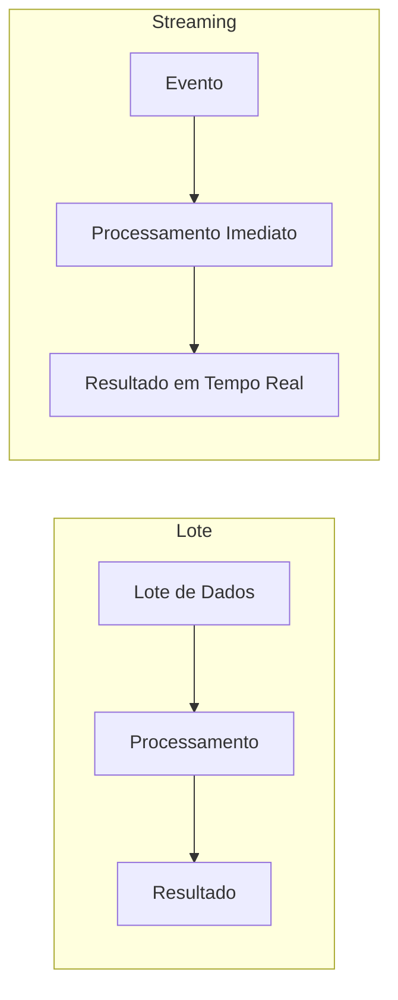
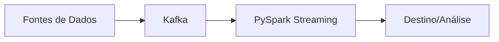
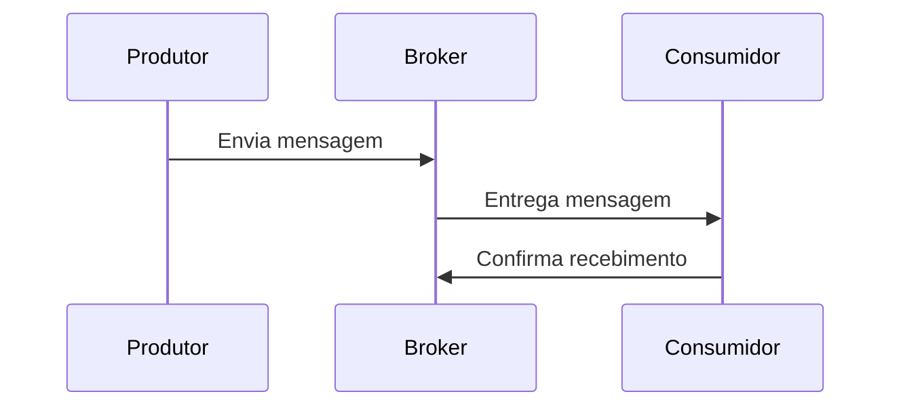
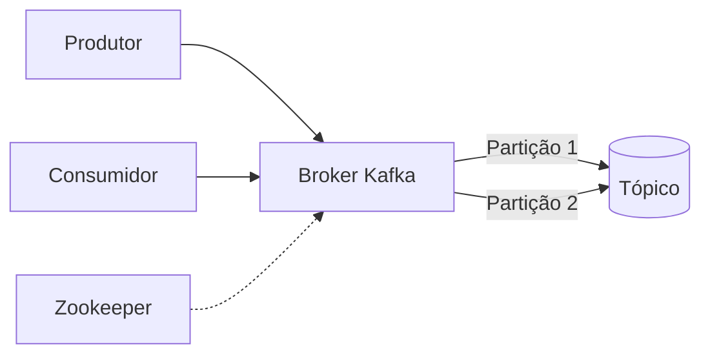
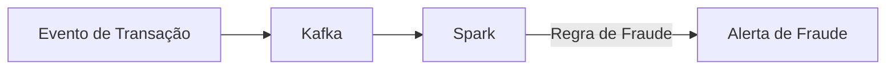
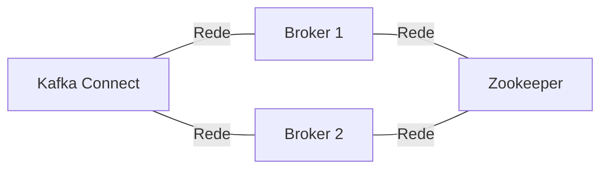
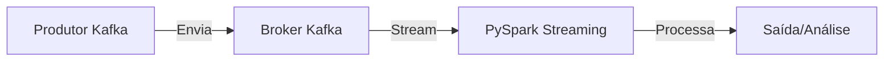

# Fundamentos de Apache Kafka e Introdução ao Processamento de Dados em Streaming

## Introdução

Seja bem-vindo(a) ao módulo de Fundamentos de Apache Kafka! Neste documento, vamos abordar de forma detalhada os conceitos essenciais sobre dados, mensageria, eventos, arquitetura distribuída e, principalmente, como o Apache Kafka se tornou uma das principais plataformas para processamento de dados em tempo real. Também veremos exemplos práticos utilizando PySpark para ilustrar como aplicar esses conceitos no dia a dia.

---

## 1. Evolução dos Dados: Volume, Variedade e Velocidade

### Os 3 Vs dos Dados

O mundo dos dados evoluiu rapidamente, e hoje falamos sobre três grandes desafios conhecidos como os "3 Vs":

- **Volume**: Quantidade massiva de dados gerados (de gigabytes para petabytes).
- **Variedade**: Diversidade de fontes e formatos (bancos relacionais, NoSQL, APIs, arquivos).
- **Velocidade**: Necessidade de processar e reagir aos dados em tempo real.

#### Exemplo prático: Processamento de dados em lote vs. streaming

```python
# Exemplo simples de leitura de dados em lote com PySpark
from pyspark.sql import SparkSession

spark = SparkSession.builder.appName("BatchExample").getOrCreate()
df = spark.read.csv("dados.csv", header=True, inferSchema=True)
df.show()
```

No processamento em lote, os dados são processados em intervalos definidos (minutos, horas). Já no streaming, o objetivo é processar os dados assim que chegam, com latência de milissegundos.

#### Diagrama: Lote vs Streaming



---

## 2. A Importância da Velocidade

Empresas como Netflix, Spotify, Airbnb e LinkedIn criaram produtos e bibliotecas para lidar com grandes volumes de dados em tempo real:

- **Netflix**: Apache Iceberg
- **Spotify**: SEO (biblioteca do Beam)
- **Airbnb**: Airflow
- **LinkedIn**: Kafka

O foco atual é **velocidade**: processar, analisar e reagir a eventos em milissegundos.

#### Exemplo prático: Leitura de dados em streaming com PySpark

```python
# Exemplo de leitura de dados em streaming com PySpark
from pyspark.sql.types import StructType, StringType, IntegerType

schema = StructType() \
    .add("id", IntegerType()) \
    .add("mensagem", StringType())

stream_df = spark.readStream \
    .schema(schema) \
    .json("caminho/para/diretorio/streaming")

query = stream_df.writeStream \
    .outputMode("append") \
    .format("console") \
    .start()

query.awaitTermination()
```

#### Diagrama: Pipeline de Streaming



---

## 3. Mensageria: De Filas a Tópicos

### Sistemas de Mensageria

Tradicionalmente, sistemas como RabbitMQ utilizam filas para troca de mensagens entre produtores e consumidores. A mensagem é consumida e removida da fila.

#### Evolução para Tópicos

O Kafka introduz o conceito de **tópicos**: ao invés de uma fila efêmera, as mensagens são persistidas em disco e podem ser consumidas por múltiplos consumidores, em diferentes momentos.

- **Produtor**: Envia mensagens para um tópico.
- **Consumidor**: Lê mensagens do tópico.
- **Broker**: Servidor que armazena os dados dos tópicos.
- **Partições**: Cada tópico é dividido em partições para escalabilidade.

#### Exemplo prático: Simulando produção e consumo de dados com PySpark

```python
# Simulando produção de dados (escrita em um diretório monitorado)
import time
import json

for i in range(10):
    with open(f"caminho/para/diretorio/streaming/mensagem_{i}.json", "w") as f:
        json.dump({"id": i, "mensagem": f"Mensagem {i}"}, f)
    time.sleep(1)
```

#### Diagrama: Produtor, Broker e Consumidor



---

## 4. Apache Kafka: Arquitetura e Componentes

### Componentes Principais

- **Broker**: Responsável por armazenar e gerenciar os tópicos e partições.
- **Producer API**: Interface para aplicações enviarem dados ao Kafka.
- **Consumer API**: Interface para aplicações lerem dados do Kafka.
- **Kafka Connect**: Facilita integração com bancos de dados e outros sistemas sem necessidade de código.
- **Kafka Streams**: Biblioteca para processamento de dados em tempo real diretamente no Kafka.
- **Zookeeper**: Gerencia metadados e coordenação do cluster (em processo de substituição pelo KRaft).

#### Exemplo prático: Consumindo dados de Kafka com PySpark

```python
# Exemplo de leitura de dados do Kafka com PySpark
df_kafka = spark.readStream \
    .format("kafka") \
    .option("kafka.bootstrap.servers", "localhost:9092") \
    .option("subscribe", "topico_exemplo") \
    .load()

df_valores = df_kafka.selectExpr("CAST(value AS STRING)")
query = df_valores.writeStream \
    .outputMode("append") \
    .format("console") \
    .start()

query.awaitTermination()
```

#### Diagrama: Arquitetura Kafka



---

## 5. Casos de Uso: Detecção de Fraude em Tempo Real

Um dos principais usos de streaming é a detecção de fraude, onde a resposta precisa ser quase instantânea.

#### Exemplo prático: Processamento de eventos de fraude

```python
from pyspark.sql.functions import col

# Supondo que o dado de entrada tem um campo 'valor'
fraudes = stream_df.filter(col("valor") > 10000)  # Exemplo de regra simples

fraudes.writeStream \
    .outputMode("append") \
    .format("console") \
    .start()
```

#### Diagrama: Detecção de Fraude



---

## 6. Implementações e Distribuições do Kafka

- **Open Source (Vanilla)**: Instalação manual do Apache Kafka.
- **Confluent Cloud**: Kafka gerenciado na nuvem, com recursos adicionais.
- **AWS MSK**: Kafka gerenciado pela AWS.
- **Azure HDInsight**: Kafka gerenciado pela Microsoft (atenção à versão).
- **Strimzi**: Kafka em Kubernetes, ideal para ambientes flexíveis e escaláveis.

---

## 7. Considerações sobre Arquitetura

- **Separação de componentes**: Brokers, Zookeeper e Connect devem rodar em servidores separados para evitar problemas de performance e disponibilidade.
- **Persistência**: Escolha adequada de discos (SSD para workloads intensos).
- **Gerenciamento**: Soluções gerenciadas reduzem a necessidade de administração, mas podem ter custos maiores.

#### Diagrama: Separação de Componentes



---

## 8. Exemplo Completo: Pipeline de Streaming com PySpark e Kafka

```python
# 1. Produzindo dados para o Kafka (exemplo em Python puro)
from kafka import KafkaProducer
import json

producer = KafkaProducer(bootstrap_servers='localhost:9092',
                         value_serializer=lambda v: json.dumps(v).encode('utf-8'))

for i in range(100):
    producer.send('topico_exemplo', {'id': i, 'mensagem': f'Mensagem {i}'})

producer.flush()

# 2. Consumindo e processando dados em tempo real com PySpark
from pyspark.sql import SparkSession
from pyspark.sql.functions import from_json, col
from pyspark.sql.types import StructType, StringType, IntegerType

spark = SparkSession.builder.appName("KafkaStreaming").getOrCreate()

schema = StructType() \
    .add("id", IntegerType()) \
    .add("mensagem", StringType())

df_kafka = spark.readStream \
    .format("kafka") \
    .option("kafka.bootstrap.servers", "localhost:9092") \
    .option("subscribe", "topico_exemplo") \
    .load()

df_valores = df_kafka.selectExpr("CAST(value AS STRING) as json") \
    .select(from_json(col("json"), schema).alias("data")) \
    .select("data.*")

# Exemplo de processamento: filtrar mensagens com id par
df_filtrado = df_valores.filter(col("id") % 2 == 0)

query = df_filtrado.writeStream \
    .outputMode("append") \
    .format("console") \
    .start()

query.awaitTermination()
```

#### Diagrama: Pipeline Completo



---

## 9. Conclusão

O Apache Kafka revolucionou o processamento de dados em tempo real, permitindo arquiteturas escaláveis, resilientes e integradas com diversas tecnologias. Combinado com ferramentas como PySpark, é possível construir pipelines robustos para ingestão, processamento e análise de dados em streaming.

**Dicas finais:**
- Participe de comunidades e eventos (Kafka Summit, Airflow Summit, etc.).
- Pratique com exemplos reais.
- Avalie sempre o custo-benefício entre soluções open source e gerenciadas.

---

## Referências

- [Documentação Oficial do Apache Kafka](https://kafka.apache.org/documentation/)
- [PySpark Structured Streaming](https://spark.apache.org/docs/latest/structured-streaming-programming-guide.html)
- [Confluent Kafka](https://www.confluent.io/)

---

*Este documento é parte do módulo de Fundamentos de Apache Kafka do curso de Engenharia de Dados.*
