# Lesson 2: Data Ingestion with Apache Kafka

> _This document was created by Amanda and is part of a personal repository containing resources and notes about streaming data processing, with a focus on Apache Kafka. It is not a course or training material. For further study, official documentation and resources are referenced throughout._

## Recap of Previous Lesson

Before proceeding, the main points from the previous lesson are briefly summarized to ensure alignment:

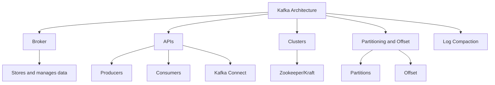

- **Kafka Architecture**: The broker is considered the main component, responsible for storing and managing data.
- **APIs**: Kafka APIs for producers, consumers, and integrations via Kafka Connect are provided.
- **Clusters**: Zookeeper (older versions) or Kraft (recent versions) are used for broker coordination.
- **Partitioning and Offset**: Each topic is divided into partitions, and each message is assigned an offset indicating its logical position.
- **Log Compaction**: Only the latest value for each key is retained, optimizing storage.

_Reference: [Kafka Architecture](https://kafka.apache.org/documentation/#architecture)_

## Fundamental Kafka Components

### Broker

The broker is operated as the server running Kafka's algorithm, storing and managing data. Its responsibilities include:

- Storing messages.
- Managing partitions and offsets.
- Replicating data among brokers to ensure high availability.

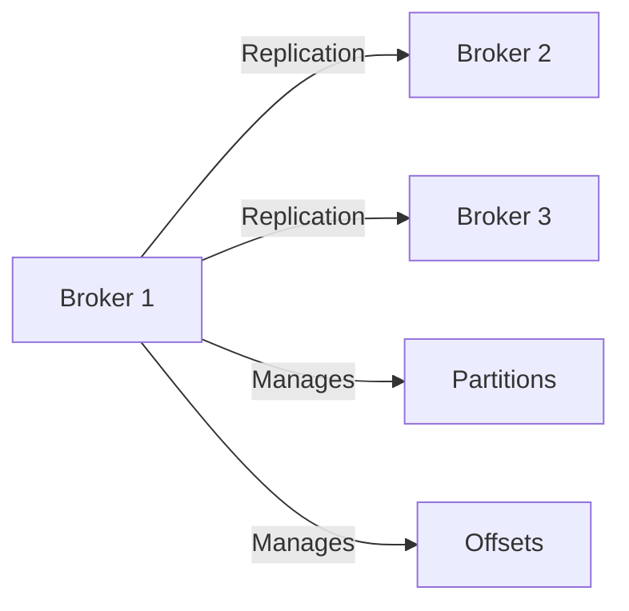

### Partitions and Offsets

- **Partition**: A logical subdivision of a topic, enabling parallelism and scalability.
- **Offset**: The sequential position of a message within a partition.

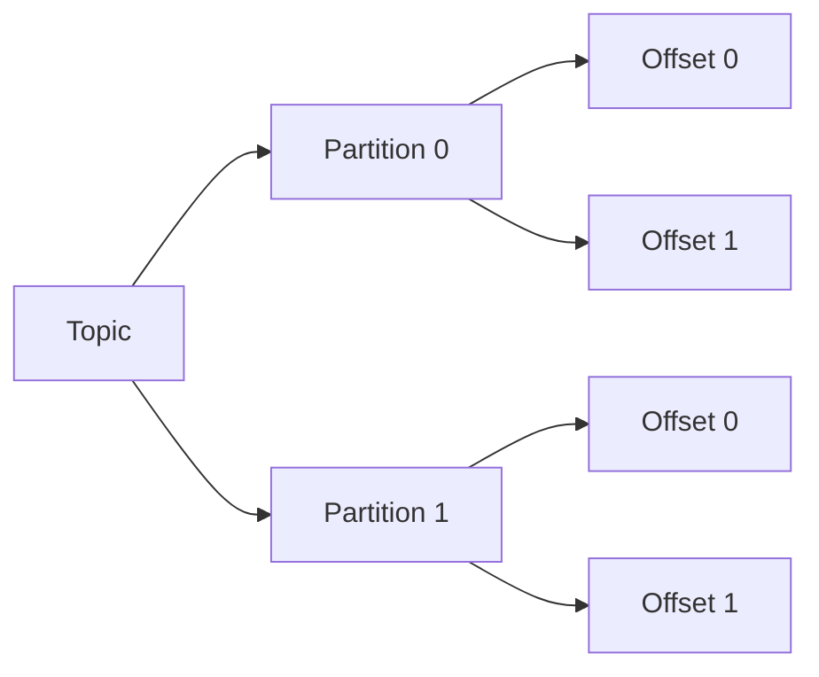

### Replication

- **Leader**: The broker responsible for handling read and write requests.
- **Followers**: Brokers maintaining copies of partitions to ensure fault tolerance.

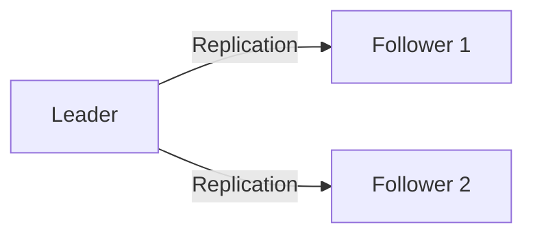

**Replication Example:**  
If the replication factor is 3, one leader and two followers are assigned for each partition.

_Reference: [Kafka Replication](https://kafka.apache.org/documentation/#replication)_

## Data Formats for Ingestion

### Format Comparison

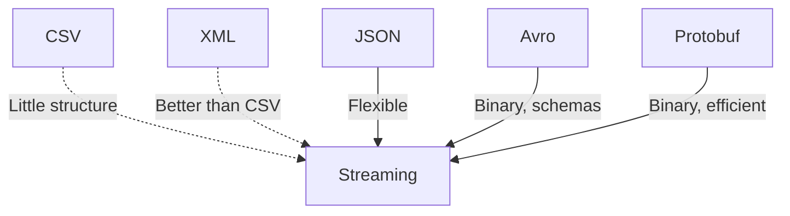

- **CSV**: Not recommended for streaming due to lack of structure and schema evolution difficulties.
- **XML**: Better than CSV, but still inefficient for streaming.
- **JSON**: Widely used, flexible, and easy to handle.
- **Avro**: Efficient binary format with schema support and native compression. Recommended for Kafka.
- **Protobuf**: Efficient alternative, but with a steeper learning curve.

_Reference: [Kafka Serialization and Formats](https://kafka.apache.org/documentation/#serialization)_

### Serialization and Schemas

Kafka stores data in binary format. To ensure data integrity and evolution, the use of schemas (especially with Avro or Protobuf) is recommended.

#### Avro Schema Example

```json
{
    "type": "record",
    "name": "User",
    "namespace": "com.example.kafka",
    "fields": [
        {"name": "id", "type": "string", "doc": "User identifier"},
        {"name": "name", "type": "string"},
        {"name": "age", "type": "int"}
    ]
}
```

_Reference: [Avro Documentation](https://avro.apache.org/docs/current/)_

## Schema Registry

The Schema Registry is operated as a component that stores and manages schemas for data transmitted in Kafka. It enables:

- Controlled schema evolution.
- Compatibility validation between versions.
- Centralized data governance.

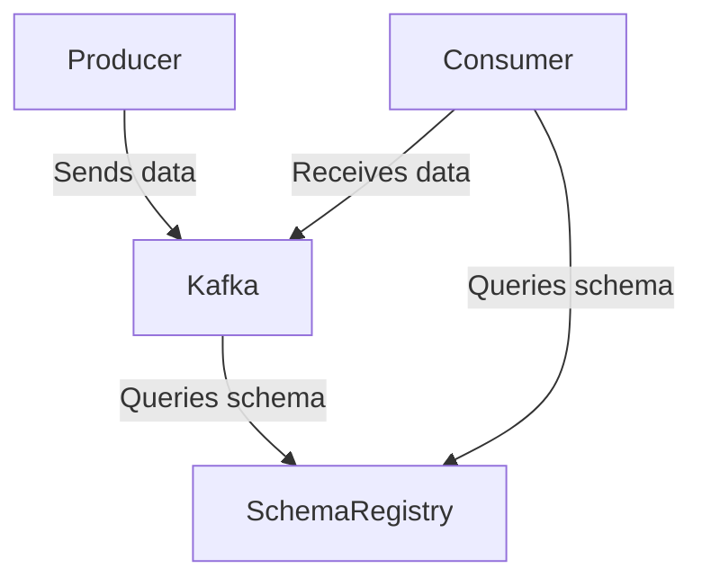

### Compatibility Modes

- **Backwards**: Older consumers continue to function after optional fields are added.
- **Forwards**: Older producers continue to function after optional fields are removed.
- **Full**: Total compatibility between versions is ensured.
- **None**: No compatibility validation is performed.

### Example: Querying Schema Registry

```bash
curl http://<schema-registry-url>/subjects
curl http://<schema-registry-url>/subjects/<subject>/versions/latest
```

_Reference: [Confluent Schema Registry](https://docs.confluent.io/platform/current/schema-registry/index.html)_

## Producing Data to Kafka

### Basic Producer Configurations

- `bootstrap.servers`: Broker addresses.
- `client.id`: Client identifier.
- `key.serializer` and `value.serializer`: Serializers for key and value.
- `acks`: Write confirmation level (`0`, `1`, `all`).
- `linger.ms`: Wait time to batch messages.
- `batch.size`: Batch size for messages.
- `compression.type`: Compression type (e.g., `lz4`, `snappy`, `gzip`).

### Sending Strategies

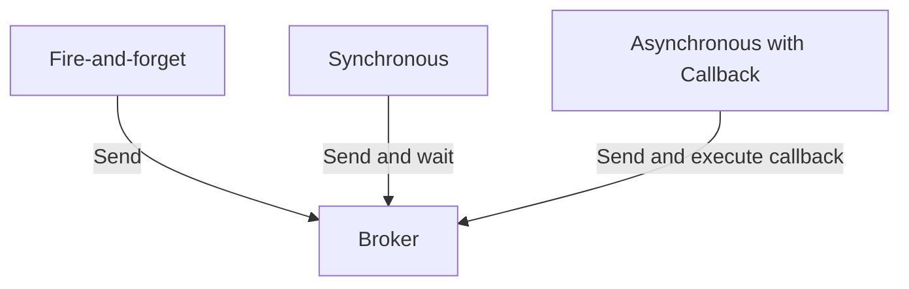

- **Fire-and-forget**: Sent without waiting for confirmation.
- **Synchronous**: Confirmation from the broker is awaited.
- **Asynchronous with Callback**: Sent and a callback function is executed upon response.

#### Python Callback Example

```python
from confluent_kafka import Producer

def delivery_report(err, msg):
        if err is not None:
                print(f'Error delivering message: {err}')
        else:
                print(f'Message delivered to {msg.topic()} [{msg.partition()}] offset {msg.offset()}')

producer = Producer({'bootstrap.servers': 'localhost:9092'})
producer.produce('my-topic', key='key', value='value', callback=delivery_report)
producer.flush()
```

### Delivery Guarantees (`acks`)

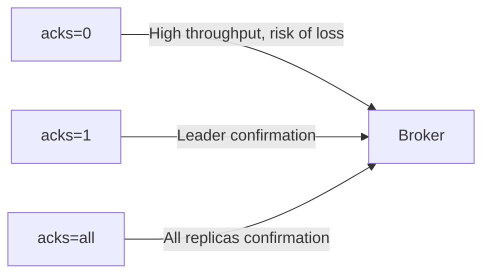

- `acks=0`: No confirmation is awaited (high throughput, risk of loss).
- `acks=1`: Leader confirmation is awaited (default).
- `acks=all`: Confirmation from all replicas is awaited (high durability, lower throughput).

_Reference: [Kafka Producer Configs](https://kafka.apache.org/documentation/#producerconfigs)_

## Optimizing Ingestion

### Batch and Linger Usage

- **Batch**: Messages are grouped for efficient sending.
- **Linger**: Maximum wait time to form a batch is defined.

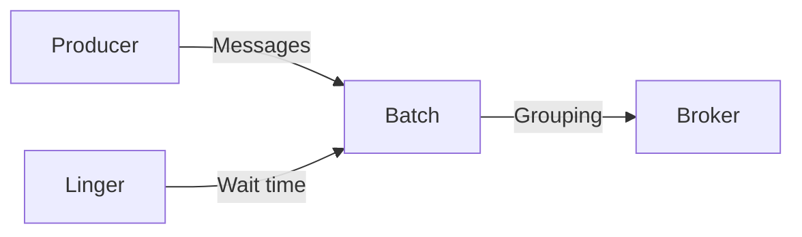

#### Configuration Example

```python
producer = Producer({
        'bootstrap.servers': 'localhost:9092',
        'batch.size': 16384,
        'linger.ms': 10,
        'compression.type': 'lz4'
})
```

### Stick Partitioning

Multiple events are allocated to the same partition, optimizing reading and processing.

## Practical Examples with PySpark

### 1. Reading Data from Kafka with PySpark

```python
from pyspark.sql import SparkSession

spark = SparkSession.builder.appName("KafkaIngestion").getOrCreate()

df = spark.readStream.format("kafka") \
        .option("kafka.bootstrap.servers", "localhost:9092") \
        .option("subscribe", "my-topic") \
        .load()

# Converting binary value to string
from pyspark.sql.functions import col
df = df.selectExpr("CAST(key AS STRING)", "CAST(value AS STRING)")

df.writeStream.format("console").start().awaitTermination()
```

### 2. Writing Data to Kafka with PySpark

```python
from pyspark.sql import SparkSession

spark = SparkSession.builder.appName("KafkaProducer").getOrCreate()

# Example DataFrame
data = [("1", "message 1"), ("2", "message 2")]
df = spark.createDataFrame(data, ["key", "value"])

df.selectExpr("CAST(key AS STRING)", "CAST(value AS STRING)") \
    .write \
    .format("kafka") \
    .option("kafka.bootstrap.servers", "localhost:9092") \
    .option("topic", "my-topic") \
    .save()
```

### 3. Avro Serialization Example with PySpark

To work with Avro, libraries such as `avro-python3` are used to serialize/deserialize data before sending to Kafka.

```python
import avro.schema
import avro.io
import io

schema_str = '''
{
    "type": "record",
    "name": "User",
    "fields": [
        {"name": "id", "type": "string"},
        {"name": "name", "type": "string"}
    ]
}
'''
schema = avro.schema.parse(schema_str)

def serialize_avro(record, schema):
        bytes_writer = io.BytesIO()
        encoder = avro.io.BinaryEncoder(bytes_writer)
        writer = avro.io.DatumWriter(schema)
        writer.write(record, encoder)
        return bytes_writer.getvalue()

user = {"id": "1", "name": "Amanda"}
avro_bytes = serialize_avro(user, schema)
```

_Reference: [PySpark Kafka Integration](https://spark.apache.org/docs/latest/structured-streaming-kafka-integration.html)_

## Best Practices

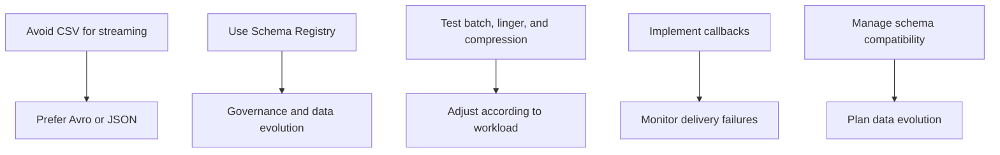

- **CSV should be avoided for streaming**: Structured formats such as Avro or JSON are preferred.
- **Schema Registry should be used**: Ensures governance and data evolution.
- **Batch, linger, and compression configurations should be tested**: Adjust according to workload.
- **Callbacks should be implemented**: Delivery failures should be monitored.
- **Schema compatibility should be managed**: Data evolution should be planned.

_Reference: [Kafka Best Practices](https://developer.confluent.io/learn/kafka-best-practices/)_

---

## Conclusion

Efficient data ingestion in Kafka is achieved through well-planned architecture, appropriate format selection, schema usage, and optimized producer configuration. PySpark integration enables real-time data pipelines, enhancing distributed processing.

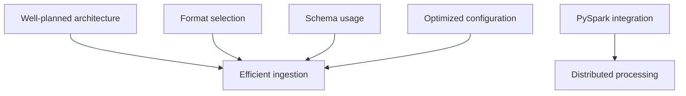

_These notes and resources were compiled by Amanda for personal reference. For deeper understanding and official guidance, consult the [Apache Kafka Documentation](https://kafka.apache.org/documentation/) and related resources._

Practice the examples, adjust configurations as needed, and explore Kafka's potential for large-scale data ingestion!

