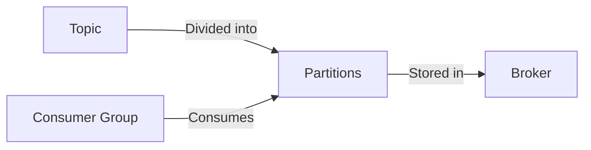
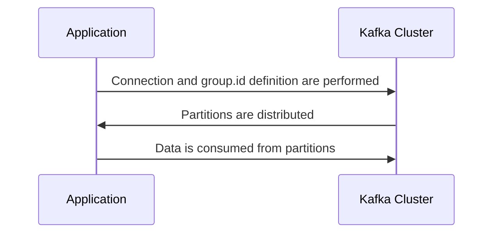
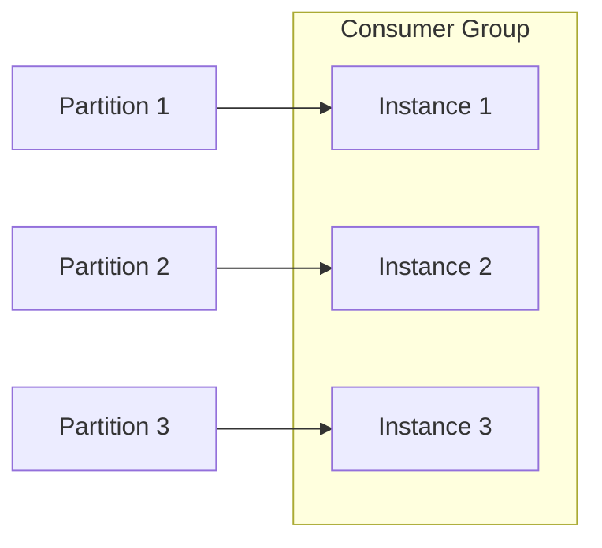
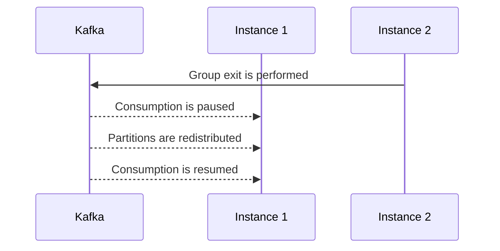
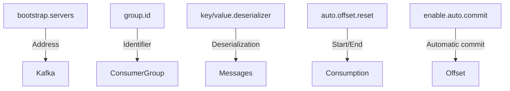
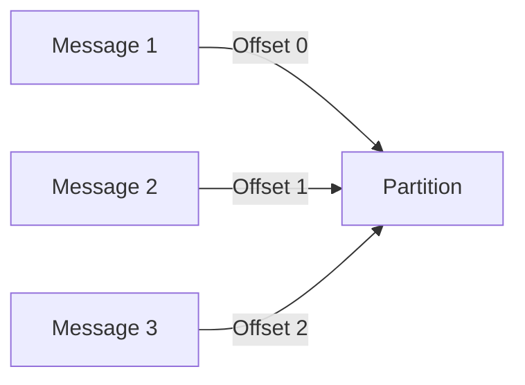
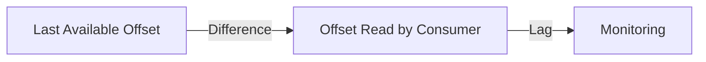
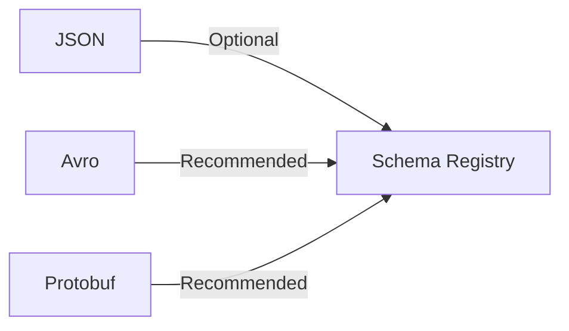
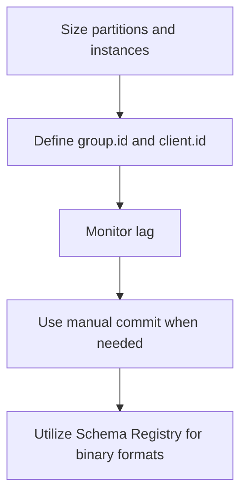
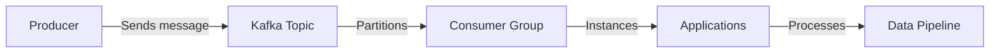

# Data Delivery with Apache Kafka: Detailed Guide

## Introduction

This document has been created by me as part of a personal repository containing content and resources related to streaming data processing, with a focus on Apache Kafka. The process of data consumption in Apache Kafka is explored, covering fundamental concepts, recommended practices, and practical examples using PySpark for real-world pipelines. Official documentation and resources are referenced to support further study.

---

## 1. Fundamentals of Kafka Consumption

### 1.1. Basic Concepts



- **Topic**: The logical channel where messages are published.
- **Partition**: The subdivision of a topic, allowing parallelism.
- **Broker**: The Kafka server responsible for storing data.
- **Consumer Group**: The grouping of consumers that work together to read data from a topic.

### 1.2. How Consumption Works



- The application is connected to the Kafka cluster and a `group.id` is defined.
- Partitions are distributed among the group instances by Kafka.
- Each instance reads data from one or more partitions.

**Important:** No consumer exists without a `Consumer Group`. If not specified, a group is created automatically by Kafka.

---

## 2. Consumer Groups and Partitions

### 2.1. Partition Distribution



- Instances are distributed according to the number of partitions.
- Excess instances remain idle; insufficient instances consume multiple partitions.

### 2.2. Rebalancing



- Kafka pauses consumption, redistributes partitions, and resumes after balancing.

**Attention:** Adding or removing partitions or instances may cause temporary unavailability.

---

## 3. Essential Consumer Configurations



- **bootstrap.servers**: The address of Kafka brokers.
- **group.id**: The identifier for the consumer group.
- **key.deserializer/value.deserializer**: How messages are deserialized.
- **auto.offset.reset**: Defines whether reading starts from the beginning (`earliest`) or end (`latest`).
- **enable.auto.commit**: Determines if the offset is committed automatically.

---

## 4. Offset and Commit

### 4.1. What is Offset?



- The **offset** is the sequential identifier of each message within a partition.

### 4.2. Offset Commit

- **Auto Commit**: Offset is committed automatically by Kafka at intervals.
- **Manual Commit**: The application controls when the offset is committed.

#### Example of Manual Commit in PySpark

```python
from pyspark.sql import SparkSession

spark = SparkSession.builder \
    .appName("KafkaConsumerExample") \
    .getOrCreate()

df = spark.readStream \
    .format("kafka") \
    .option("kafka.bootstrap.servers", "localhost:9092") \
    .option("subscribe", "my-topic") \
    .option("startingOffsets", "earliest") \
    .load()

from pyspark.sql.functions import col
df = df.selectExpr("CAST(key AS STRING)", "CAST(value AS STRING)")

query = df.writeStream \
    .format("console") \
    .option("checkpointLocation", "/tmp/checkpoint") \
    .start()

query.awaitTermination()
```

> **Note:** Offset commits are managed automatically by Spark via checkpoint.

---

## 5. Lag and Monitoring



- **Lag**: The difference between the last available offset and the offset read by the consumer.
- High lag may indicate performance issues or consumer failures.

#### Example of Lag Monitoring

```bash
kafka-consumer-groups.sh --bootstrap-server localhost:9092 --describe --group my-consumer-group
```

---

## 6. Serialization and Schema Registry



- **JSON**: Schema Registry is not required, but can be used for standardization.
- **Avro/Protobuf**: Schema Registry is recommended to ensure schema compatibility and evolution.

#### Example of Avro Consumption with PySpark

```python
df = spark.readStream \
    .format("kafka") \
    .option("kafka.bootstrap.servers", "localhost:9092") \
    .option("subscribe", "my-topic-avro") \
    .load()

from pyspark.sql.avro.functions import from_avro

avro_schema = '''
{
  "type": "record",
  "name": "Example",
  "fields": [
    {"name": "id", "type": "int"},
    {"name": "value", "type": "string"}
  ]
}
'''

df = df.withColumn("data", from_avro(col("value"), avro_schema))
df.select("data.*").writeStream.format("console").start().awaitTermination()
```

---

## 7. Best Practices



- Partitions and instances should be sized appropriately.
- `group.id` and `client.id` should always be defined.
- Consumer lag should be monitored.
- Manual commit should be used to ensure exact processing when necessary.
- Schema Registry should be utilized for binary formats (Avro/Protobuf).

---

## 8. Visual Summary



---

## 9. Conclusion

The consumption of data in Kafka is highly scalable and flexible, but attention must be paid to offset management, rebalancing, and lag monitoring. By using PySpark, Kafka data consumption can be integrated into robust distributed processing pipelines. This document was created by me as a personal resource and is not part of any course or training.

---

## 10. References

- [Apache Kafka Official Documentation](https://kafka.apache.org/documentation/)
- [Structured Streaming + Kafka Integration Guide (PySpark)](https://spark.apache.org/docs/latest/structured-streaming-kafka-integration.html)
- [Confluent Schema Registry](https://docs.confluent.io/platform/current/schema-registry/index.html)
- [Kafka Consumer Groups CLI Reference](https://kafka.apache.org/documentation/#consumerconfigs)
- [PySpark Official Documentation](https://spark.apache.org/docs/latest/api/python/)
- [Kafka Monitoring Best Practices](https://docs.confluent.io/platform/current/kafka/monitoring.html)

---