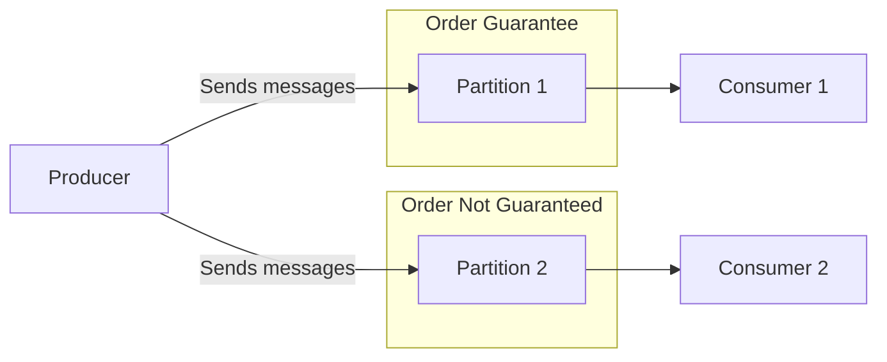
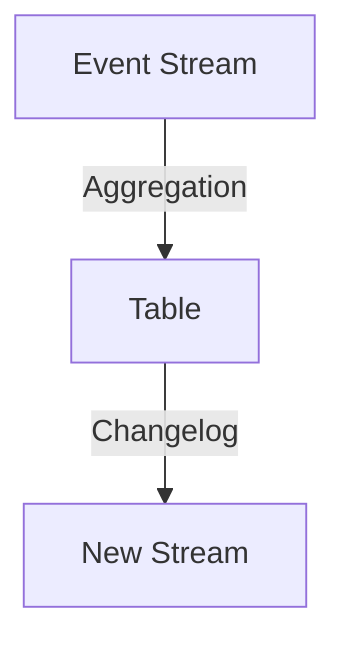
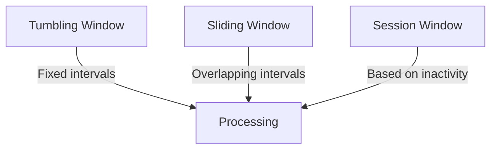
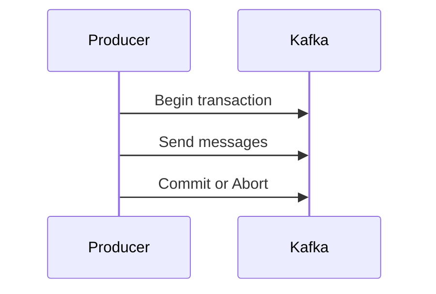
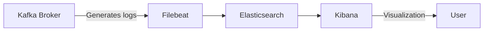
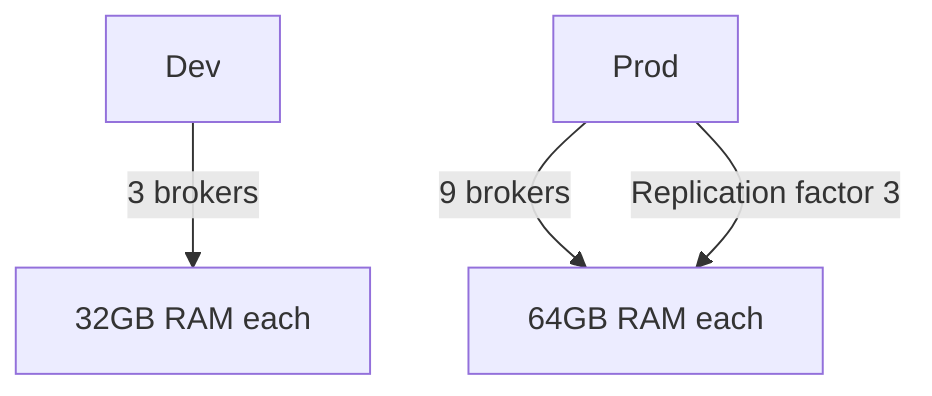
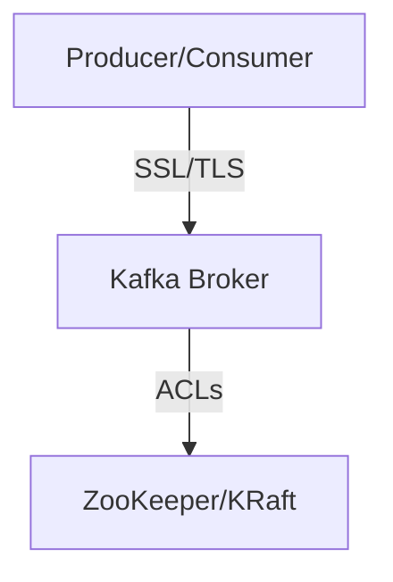
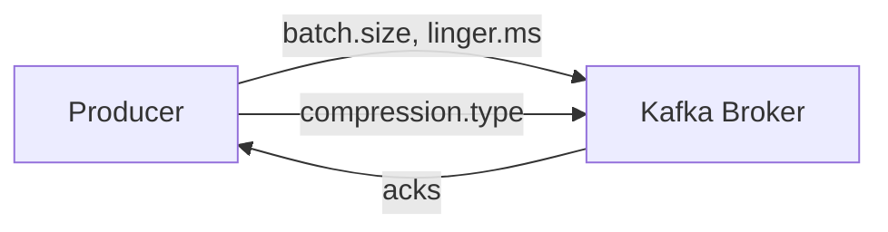
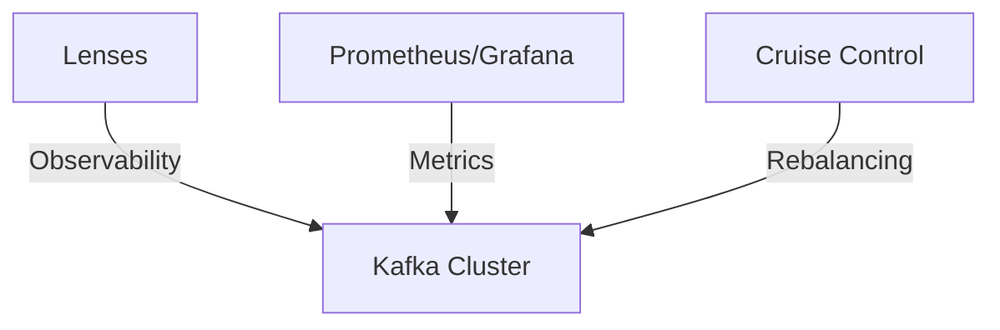
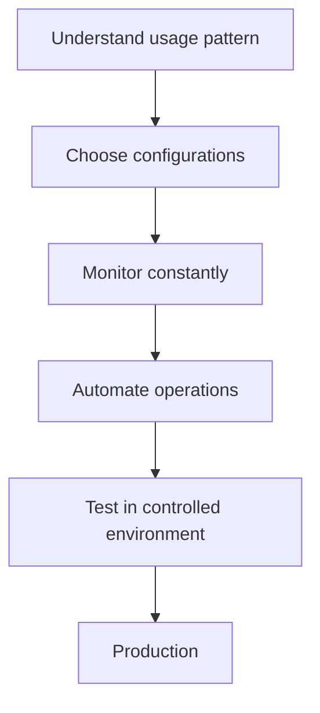

# Best Practices in Apache Kafka: Detailed Guide

This document has been created by Amanda and is part of a personal repository containing content and resources related to streaming data processing, with a focus on Apache Kafka. It is not a course or training material. Official documentation and resources are referenced throughout for further study and support.

---

## 1. Message Ordering and Partitioning

### Concept

In Kafka, message ordering is guaranteed only within a single partition. If total ordering is required, the topic should be configured with **one partition**. Otherwise, when multiple partitions are used, message order may be lost.



### Important Configurations

- **`max.in.flight.requests.per.connection`**: Controls how many messages can be sent simultaneously without confirmation. To guarantee ordering, this value should be kept at 1.
- **`acks`**: For greater durability, `acks=all` should be used. For higher throughput, `acks=1` is recommended.
- **`enable.idempotence`**: Should be enabled to avoid message duplication.

### PySpark Example: Ordered Production

```python
from kafka import KafkaProducer

producer = KafkaProducer(
    bootstrap_servers='localhost:9092',
    acks='all',
    enable_idempotence=True,
    max_in_flight_requests_per_connection=1
)

for i in range(1, 9):
    producer.send('my-topic', value=str(i).encode())
producer.flush()
```

Further reading: [Kafka Documentation - Message Ordering](https://kafka.apache.org/documentation/#producerconfigs_ordering)

---

## 2. Streams and Tables

### Difference

- **Stream**: An immutable flow of events (append-only).
- **Table**: A mutable structure representing the latest state of each key (similar to log-compaction).



### Conversion

- Streams can be aggregated to form Tables (e.g., count, sum).
- Tables can generate Streams of changes (changelog).

### PySpark Example: Aggregating Stream into Table

```python
from pyspark.sql import SparkSession
from pyspark.sql.functions import window, count

spark = SparkSession.builder.appName("KafkaStream").getOrCreate()

df = (
    spark.readStream
    .format("kafka")
    .option("kafka.bootstrap.servers", "localhost:9092")
    .option("subscribe", "my-topic")
    .load()
)

from pyspark.sql.functions import from_json, col
from pyspark.sql.types import StructType, StringType

schema = StructType().add("user", StringType())

events = df.select(from_json(col("value").cast("string"), schema).alias("data")).select("data.*")

counted = events.groupBy("user").count()

query = (
    counted.writeStream
    .outputMode("complete")
    .format("console")
    .start()
)
query.awaitTermination()
```

Reference: [Kafka Streams Concepts](https://kafka.apache.org/documentation/streams/)

---

## 3. Processing Windows

### Window Types



- **Session Window**: Based on inactivity (gap).
- **Hopping/Sliding Window**: Overlapping windows.
- **Tumbling Window**: Fixed windows, no overlap.

### PySpark Examples

#### Tumbling Window

```python
from pyspark.sql.functions import window

windowed = events.groupBy(window(col("timestamp"), "1 minute")).count()
```

#### Sliding Window

```python
windowed = events.groupBy(window(col("timestamp"), "1 minute", "30 seconds")).count()
```

#### Session Window

Native session window is not available in PySpark, but can be simulated with additional logic.

Reference: [Kafka Streams - Windowing](https://kafka.apache.org/documentation/streams/developer-guide/windowing.html)

---

## 4. Kafka Transactions

### When to Use

Transactions ensure that multiple read/process/write operations are atomic. They are useful for critical pipelines, but add complexity and may impact performance (~3% throughput reduction).



### Basic Flow

1. Transaction is started on the producer.
2. Messages are processed and sent.
3. Transaction is committed or aborted.

### PySpark Example

PySpark does not natively support Kafka transactions, but they can be implemented via the Kafka Java or Python API.

Reference: [Kafka Transactions](https://kafka.apache.org/documentation/#transactions)

---

## 5. Logs and Monitoring



- **INFO and WARNING**: Informative Kafka messages are valuable for troubleshooting.
- **Log Export**: Filebeat + Elasticsearch + Kibana should be used to centralize and analyze logs.

Reference: [Kafka Monitoring](https://kafka.apache.org/documentation/#monitoring)

---

## 6. Sizing and Infrastructure

### General Rules

- **Disk**: The most critical resource. Monitoring and alerting should be set from 70% usage.
- **Memory**: Brokers require memory proportional to data volume and partitions.
- **CPU**: Important, but less critical than disk.



Reference: [Kafka Hardware Recommendations](https://kafka.apache.org/documentation/#hardware)

---

## 7. Security



- **Authentication**: SSL/TLS or SASL should be used.
- **Authorization**: ACLs on ZooKeeper (or controller, if using KRaft).
- **ZeroCopy**: Enabling SSL/TLS disables ZeroCopy write optimization.

Reference: [Kafka Security](https://kafka.apache.org/documentation/#security)

---

## 8. Throughput and Latency Optimization



### Throughput

- `batch.size` and `linger.ms` should be increased on the producer.
- Compression (`compression.type`) should be used.
- `acks=1` for higher speed.

### Latency

- `linger.ms` should be reduced to 0.
- Compression should be disabled.
- `acks=1` for lower wait time.

### Durability

- `acks=all`, `enable.idempotence=true`, high replication factor.
- `auto.create.topics.enable` should be disabled.
- `min.insync.replicas` should be adjusted to ensure replication.

Reference: [Kafka Performance Tuning](https://kafka.apache.org/documentation/#producerconfigs)

---

## 9. Observability Tools



- **Lenses**: Platform for development, troubleshooting, and observability of Kafka clusters.
- **Prometheus/Grafana**: For metrics.
- **Cruise Control**: For automatic partition rebalancing.

Reference: [Kafka Ecosystem Tools](https://kafka.apache.org/documentation/#ecosystem)

---

## 10. Practical Examples in PySpark

### Consuming Data from Kafka

```python
df = (
    spark.readStream
    .format("kafka")
    .option("kafka.bootstrap.servers", "localhost:9092")
    .option("subscribe", "my-topic")
    .load()
)
```

### Writing to Kafka Topic

```python
query = (
    df.selectExpr("CAST(key AS STRING)", "CAST(value AS STRING)")
    .writeStream
    .format("kafka")
    .option("kafka.bootstrap.servers", "localhost:9092")
    .option("topic", "destination-topic")
    .option("checkpointLocation", "/tmp/checkpoint")
    .start()
)
query.awaitTermination()
```

Reference: [PySpark Structured Streaming + Kafka](https://spark.apache.org/docs/latest/structured-streaming-kafka-integration.html)

---

## 11. Final Recommendations



- **Usage patterns should be understood**: Configurations should be chosen according to use case (latency, throughput, durability).
- **Constant monitoring should be performed**: Logs, metrics, and resource usage.
- **Administrative operations should be automated**: Tools like Cruise Control should be used.
- **Configurations should be tested in controlled environments** before applying to production.

---

This guide has been created by Amanda as a reference for architecting, operating, and optimizing Kafka environments, with practical examples for application in PySpark. Recommendations should be adapted according to project needs and kept up to date with best practices from the Kafka community.

For further study and support, consult the [Apache Kafka Official Documentation](https://kafka.apache.org/documentation/).
