# Aula 2: Ingestão de Dados com Apache Kafka

## Recapitulando a Aula Anterior

Antes de avançarmos, vamos relembrar rapidamente os principais pontos da aula anterior para garantir que todos estejam na mesma página:

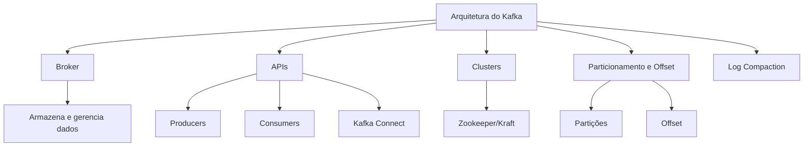

- **Arquitetura do Kafka**: O broker é o principal componente, responsável por armazenar e gerenciar os dados.
- **APIs**: Kafka oferece APIs para producers, consumers e integrações via Kafka Connect.
- **Clusters**: Utilização de Zookeeper (em versões antigas) ou Kraft (nas mais recentes) para coordenação dos brokers.
- **Particionamento e Offset**: Cada tópico é dividido em partições, e cada mensagem possui um offset, que indica sua posição lógica.
- **Log Compaction**: Permite manter apenas o último valor de cada chave, otimizando o armazenamento.

## Componentes Fundamentais do Kafka

### Broker

O broker é o servidor que executa o algoritmo do Kafka, armazenando e gerenciando os dados. Ele é responsável por:

- Armazenar mensagens.
- Gerenciar partições e offsets.
- Replicar dados entre brokers para garantir alta disponibilidade.

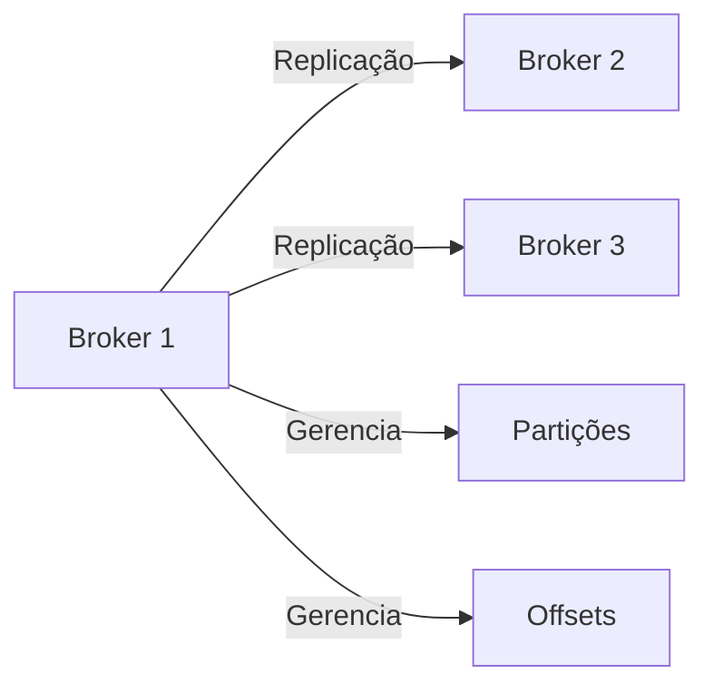

### Partições e Offsets

- **Partição**: Subdivisão lógica de um tópico, permitindo paralelismo e escalabilidade.
- **Offset**: Posição sequencial de uma mensagem dentro de uma partição.

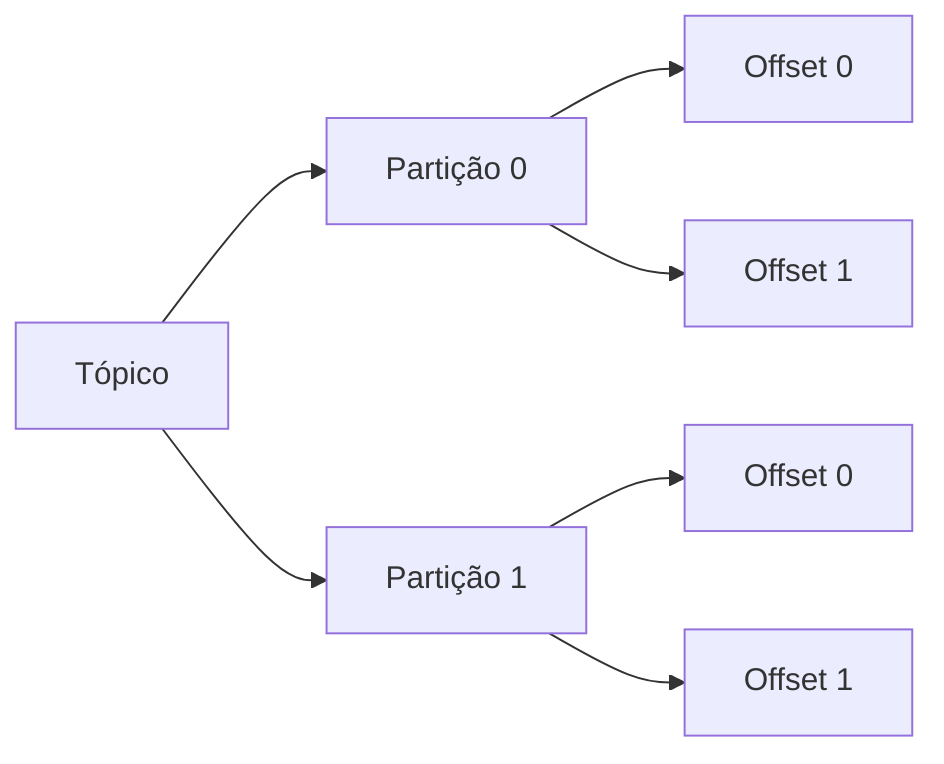

### Replicação

- **Leader**: Broker responsável por receber e servir as requisições de leitura e escrita.
- **Followers**: Brokers que mantêm cópias das partições para garantir tolerância a falhas.

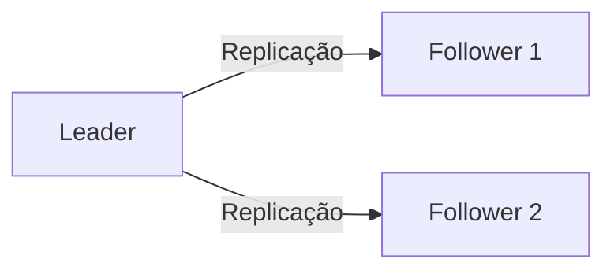

**Exemplo de Replicação:**  
Se o fator de replicação é 3, teremos 1 leader e 2 followers para cada partição.

## Formatos de Dados para Ingestão

### Comparação de Formatos

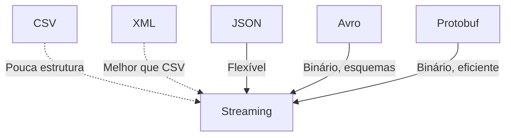

- **CSV**: Não recomendado para streaming devido à falta de estrutura e dificuldade de evolução de esquema.
- **XML**: Melhor que CSV, mas ainda pouco eficiente para streaming.
- **JSON**: Bastante utilizado, flexível e fácil de manipular.
- **Avro**: Formato binário eficiente, com suporte a esquemas e compressão nativa. Recomendado para uso com Kafka.
- **Protobuf**: Alternativa eficiente, mas com curva de aprendizado maior.

### Serialização e Esquemas

O Kafka armazena dados em formato binário. Para garantir a integridade e evolução dos dados, recomenda-se o uso de esquemas (principalmente com Avro ou Protobuf).

#### Exemplo de Esquema Avro

```json
{
    "type": "record",
    "name": "User",
    "namespace": "com.exemplo.kafka",
    "fields": [
        {"name": "id", "type": "string", "doc": "Identificador do usuário"},
        {"name": "nome", "type": "string"},
        {"name": "idade", "type": "int"}
    ]
}
```

## Schema Registry

O Schema Registry é um componente que armazena e gerencia os esquemas dos dados trafegados no Kafka. Ele permite:

- Evolução controlada dos esquemas.
- Validação de compatibilidade entre versões.
- Centralização da governança dos dados.

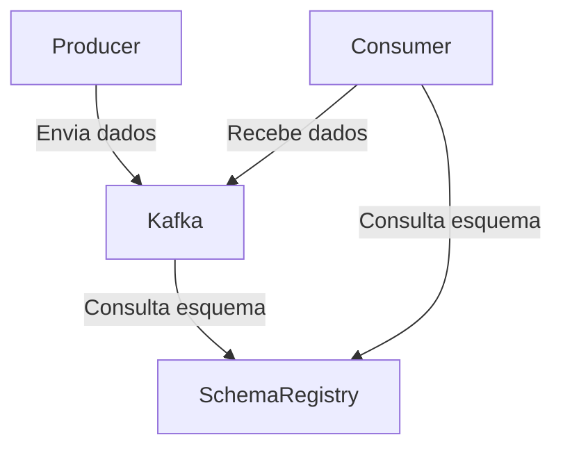

### Modos de Compatibilidade

- **Backwards**: Consumidores antigos continuam funcionando após adição de campos opcionais.
- **Forwards**: Producers antigos continuam funcionando após remoção de campos opcionais.
- **Full**: Garante compatibilidade total entre versões.
- **None**: Sem validação de compatibilidade.

### Exemplo de Consulta ao Schema Registry

```bash
curl http://<schema-registry-url>/subjects
curl http://<schema-registry-url>/subjects/<subject>/versions/latest
```

## Produzindo Dados no Kafka

### Configurações Básicas do Producer

- `bootstrap.servers`: Endereço dos brokers.
- `client.id`: Identificador do cliente.
- `key.serializer` e `value.serializer`: Serializadores para chave e valor.
- `acks`: Nível de confirmação de gravação (`0`, `1`, `all`).
- `linger.ms`: Tempo de espera para agrupar mensagens em batch.
- `batch.size`: Tamanho do lote de mensagens.
- `compression.type`: Tipo de compressão (ex: `lz4`, `snappy`, `gzip`).

### Estratégias de Envio

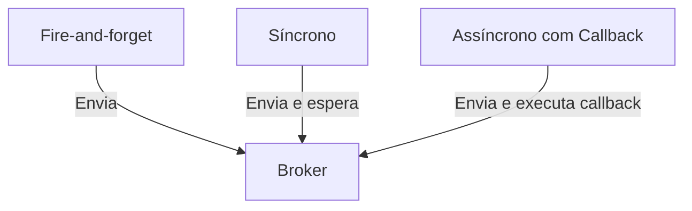

- **Fire-and-forget**: Envia sem esperar confirmação.
- **Síncrono**: Aguarda confirmação do broker.
- **Assíncrono com Callback**: Envia e executa função de callback ao receber resposta.

#### Exemplo de Callback em Python

```python
from confluent_kafka import Producer

def delivery_report(err, msg):
        if err is not None:
                print(f'Erro ao entregar mensagem: {err}')
        else:
                print(f'Mensagem entregue em {msg.topic()} [{msg.partition()}] offset {msg.offset()}')

producer = Producer({'bootstrap.servers': 'localhost:9092'})
producer.produce('meu-topico', key='chave', value='valor', callback=delivery_report)
producer.flush()
```

### Garantias de Entrega (`acks`)

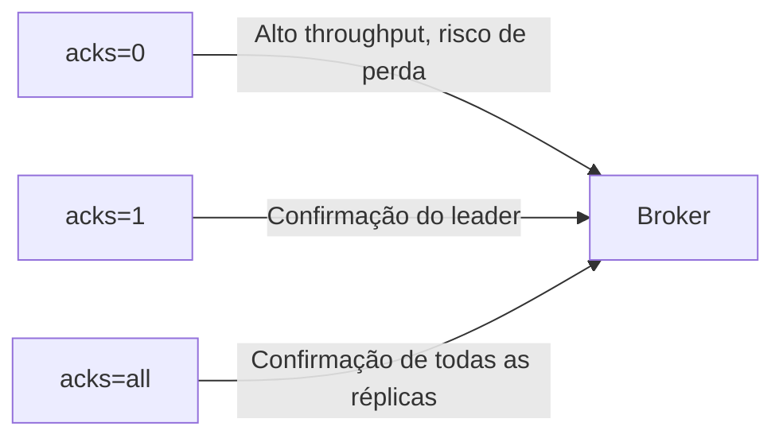

- `acks=0`: Não espera confirmação (alto throughput, risco de perda).
- `acks=1`: Espera confirmação do leader (padrão).
- `acks=all`: Espera confirmação de todas as réplicas (alta durabilidade, menor throughput).

## Otimizando a Ingestão

### Uso de Batch e Linger

- **Batch**: Agrupa mensagens para envio eficiente.
- **Linger**: Define o tempo máximo de espera para formar um batch.

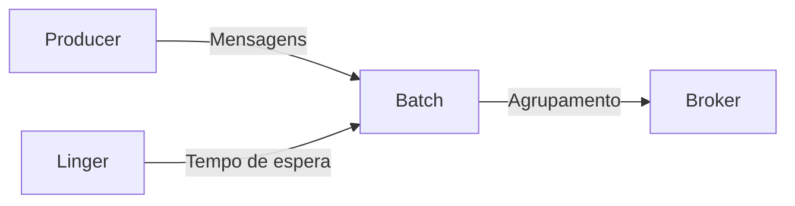

#### Exemplo de Configuração

```python
producer = Producer({
        'bootstrap.servers': 'localhost:9092',
        'batch.size': 16384,
        'linger.ms': 10,
        'compression.type': 'lz4'
})
```

### Stick Partitioning

Permite alocar múltiplos eventos na mesma partição, otimizando a leitura e o processamento.

## Exemplos Práticos com PySpark

### 1. Lendo Dados do Kafka com PySpark

```python
from pyspark.sql import SparkSession

spark = SparkSession.builder.appName("KafkaIngestao").getOrCreate()

df = spark.readStream.format("kafka") \
        .option("kafka.bootstrap.servers", "localhost:9092") \
        .option("subscribe", "meu-topico") \
        .load()

# Convertendo valor binário para string
from pyspark.sql.functions import col
df = df.selectExpr("CAST(key AS STRING)", "CAST(value AS STRING)")

df.writeStream.format("console").start().awaitTermination()
```

### 2. Gravando Dados no Kafka com PySpark

```python
from pyspark.sql import SparkSession

spark = SparkSession.builder.appName("KafkaProducer").getOrCreate()

# Exemplo de DataFrame
dados = [("1", "mensagem 1"), ("2", "mensagem 2")]
df = spark.createDataFrame(dados, ["key", "value"])

df.selectExpr("CAST(key AS STRING)", "CAST(value AS STRING)") \
    .write \
    .format("kafka") \
    .option("kafka.bootstrap.servers", "localhost:9092") \
    .option("topic", "meu-topico") \
    .save()
```

### 3. Exemplo de Serialização Avro com PySpark

Para trabalhar com Avro, utilize bibliotecas como `avro-python3` para serializar/deserializar os dados antes de enviar ao Kafka.

```python
import avro.schema
import avro.io
import io

schema_str = '''
{
    "type": "record",
    "name": "User",
    "fields": [
        {"name": "id", "type": "string"},
        {"name": "nome", "type": "string"}
    ]
}
'''
schema = avro.schema.parse(schema_str)

def serialize_avro(record, schema):
        bytes_writer = io.BytesIO()
        encoder = avro.io.BinaryEncoder(bytes_writer)
        writer = avro.io.DatumWriter(schema)
        writer.write(record, encoder)
        return bytes_writer.getvalue()

user = {"id": "1", "nome": "Amanda"}
avro_bytes = serialize_avro(user, schema)
```

## Boas Práticas

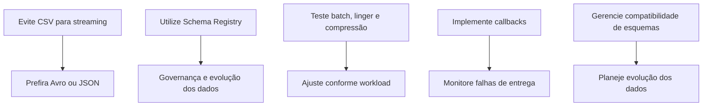

- **Evite CSV para streaming**: Prefira formatos estruturados como Avro ou JSON.
- **Utilize Schema Registry**: Garante governança e evolução dos dados.
- **Teste configurações de batch, linger e compressão**: Ajuste conforme o workload.
- **Implemente callbacks**: Monitore falhas de entrega.
- **Gerencie compatibilidade de esquemas**: Planeje a evolução dos dados.

---

## Conclusão

A ingestão eficiente de dados no Kafka depende de uma arquitetura bem planejada, escolha adequada de formatos, uso de esquemas e configuração otimizada dos producers. O uso de PySpark permite integrar pipelines de dados em tempo real, potencializando o processamento distribuído.

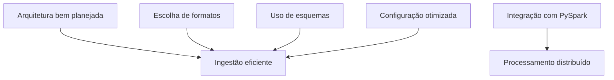

Pratique os exemplos, ajuste as configurações conforme sua necessidade e explore o potencial do Kafka para ingestão de dados em larga escala!
