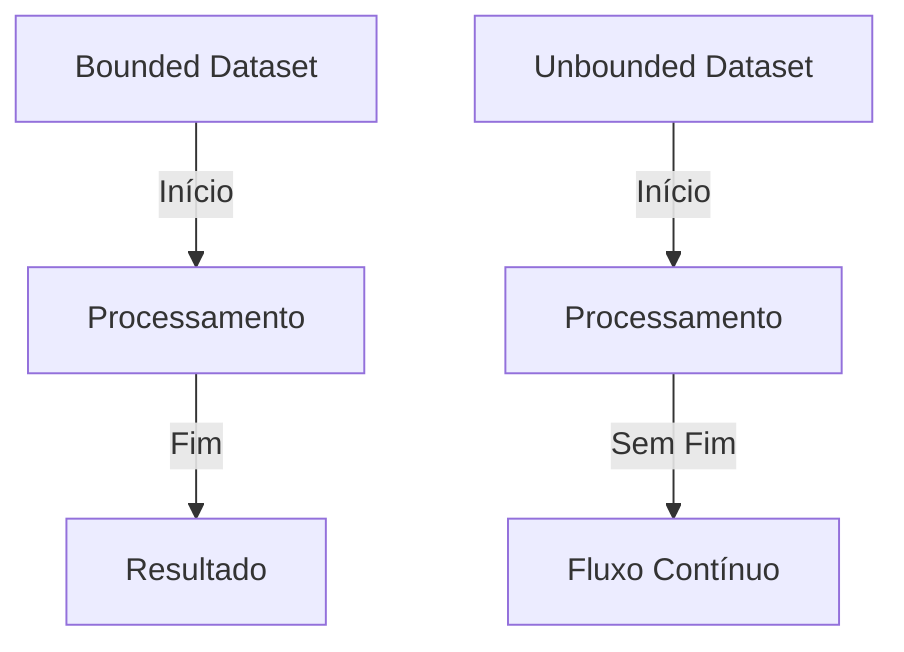
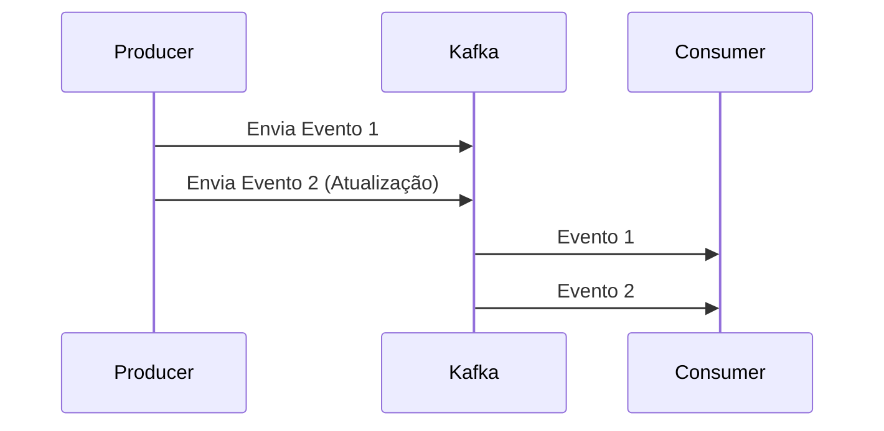
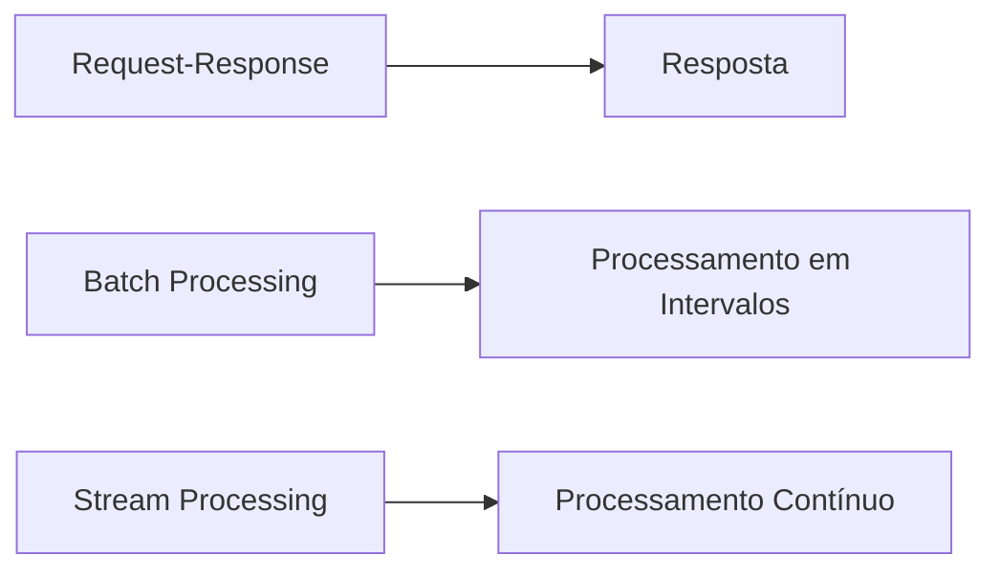
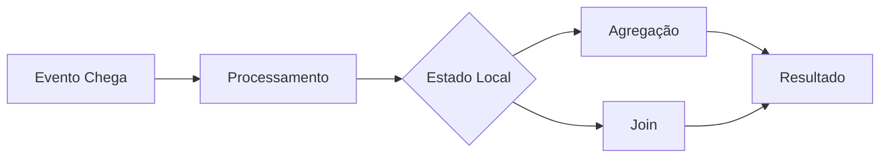
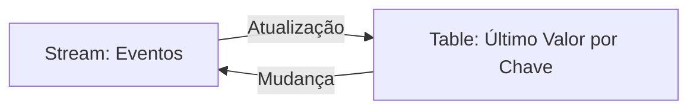
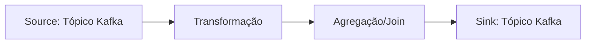
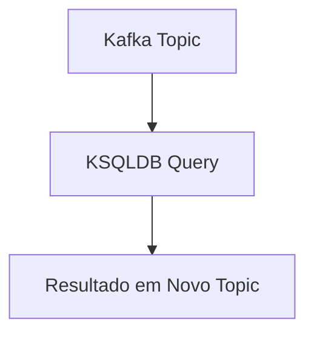

# Aula 03: Processamento de Dados com Apache Kafka

## Introdução

Bem-vindo à terceira aula do nosso treinamento de Apache Kafka! Neste módulo, vamos abordar o **processamento de eventos** e o **processamento em streaming**, temas fundamentais para quem deseja extrair valor dos dados em tempo real.

---

## O que é Processamento de Eventos e Streaming?

O Apache Kafka é amplamente conhecido por sua capacidade de armazenar e transmitir dados em streaming. Até aqui, vimos como realizar a ingestão de dados usando Kafka Connect, Producers, e melhores práticas para leitura de diferentes fontes, inclusive bancos de dados. Também exploramos transformações simples (SMT) no Connect.

Agora, avançamos para **transformações mais complexas**, onde modificamos e geramos novos dados a partir dos eventos recebidos. O objetivo é enriquecer os dados brutos, tornando-os úteis para a tomada de decisão.

### Por que o processamento em streaming é importante?

Antigamente, as empresas focavam em grupos de clientes para criar produtos. Hoje, o foco é cada vez mais individualizado: criar produtos específicos para cada cliente. O processamento em streaming permite essa personalização, pois possibilita reagir a eventos em tempo real e adaptar estratégias rapidamente.

---

## Conceitos Fundamentais de Streaming

### Event Stream

Um **event stream** é uma sequência ordenada de eventos ao longo do tempo, cada um com seu próprio timestamp. No Kafka, cada evento pode ser lido múltiplas vezes, permitindo o replay de dados históricos.

#### Bounded vs. Unbounded

- **Bounded Dataset**: Tem início e fim definidos (ex: processamento batch).
- **Unbounded Dataset**: Fluxo contínuo de dados, sem fim definido (ex: streaming).



### Imutabilidade dos Eventos

No streaming, eventos são **imutáveis**. Atualizações ou deleções geram novos eventos, que são apenas adicionados ao fluxo. Não há update/delete direto em eventos já processados.



### Replay de Eventos

O Kafka permite o replay de eventos, ou seja, é possível reler eventos antigos a partir de qualquer offset da partição, diferente de sistemas tradicionais de mensageria.

---

## Tipos de Processamento

- **Request-Response**: Comunicação tradicional client-server.
- **Stream Processing**: Processamento contínuo de eventos, com possibilidade de joins, agregações e transformações em tempo real.
- **Batch Processing**: Processamento de grandes volumes de dados em intervalos definidos.



Nosso foco será o **stream processing**, buscando sempre baixa latência e transformação dos dados em tempo real.

---

## Micro-Batching vs. Streaming Real-Time

Ferramentas como Spark Streaming utilizam o conceito de **micro-batch** (ex: processar eventos a cada 100ms). Apesar de não ser "real-time" absoluto, é considerado tempo real para a maioria dos casos de uso.

```mermaid
gantt
    title Micro-Batching vs Streaming
    dateFormat  X
    section Micro-Batch
    Batch 1 :a1, 0, 100
    Batch 2 :a2, 100, 100
    Batch 3 :a3, 200, 100
    section Streaming
    Evento Contínuo :active, 0, 300
```



### Exemplo prático com PySpark

```python
from pyspark.sql import SparkSession
from pyspark.sql.functions import from_json, col
from pyspark.sql.types import StructType, StringType, IntegerType

# Criação da sessão Spark
spark = SparkSession.builder \
    .appName("KafkaStreamingExample") \
    .getOrCreate()

# Definição do schema dos dados
schema = StructType() \
    .add("client_id", StringType()) \
    .add("compra", IntegerType())

# Leitura do stream do Kafka
df = spark.readStream \
    .format("kafka") \
    .option("kafka.bootstrap.servers", "localhost:9092") \
    .option("subscribe", "compras") \
    .load()

# Conversão do valor para string e parsing do JSON
json_df = df.selectExpr("CAST(value AS STRING) as json") \
    .select(from_json(col("json"), schema).alias("data")) \
    .select("data.*")

# Agregação: média de compras por cliente
agg_df = json_df.groupBy("client_id").avg("compra")

# Escrita do resultado em console (poderia ser outro tópico Kafka, banco, etc)
query = agg_df.writeStream \
    .outputMode("complete") \
    .format("console") \
    .start()

query.awaitTermination()
```

---

## Estado no Processamento de Streaming

Ao processar streams, muitas operações exigem **manutenção de estado** (ex: agregações, joins). O estado pode ser armazenado localmente (ex: RocksDB) ou externamente (ex: Cassandra), mas a recomendação é sempre priorizar o armazenamento local para garantir baixa latência.



---

## Dualidade Stream-Table

No processamento de streams, existe a dualidade entre **stream** (sequência de eventos) e **table** (snapshot do último valor por chave). Ferramentas como Kafka Streams e Flink permitem converter entre esses dois conceitos.



---

## Kafka Streams

O **Kafka Streams** é uma biblioteca Java/Scala para processamento de dados em tempo real diretamente no Kafka. Permite consumir, transformar, agregar e produzir dados de volta para o Kafka, mantendo o estado localmente via RocksDB.

### Anatomia de um processamento com Kafka Streams



### Exemplo de pipeline em PySpark (simulando lógica similar)

```python
from pyspark.sql.functions import expr

# Supondo que já temos json_df do exemplo anterior

# Filtrar apenas compras acima de um valor
filtered_df = json_df.filter(col("compra") > 100)

# Escrever em outro tópico Kafka
filtered_df.selectExpr("to_json(struct(*)) AS value") \
    .writeStream \
    .format("kafka") \
    .option("kafka.bootstrap.servers", "localhost:9092") \
    .option("topic", "compras_filtradas") \
    .start()
```

---

## KSQLDB

O **ksqldb** permite processar streams do Kafka usando SQL, facilitando para times de dados que preferem abstrações declarativas. Apesar de ser fácil de usar, tem limitações de flexibilidade e está sendo gradualmente substituído por outras soluções no ecossistema.



---

## Considerações Finais

- **Processamento em streaming** é essencial para aplicações modernas, permitindo reações rápidas e personalizadas.
- **Estado** deve ser preferencialmente mantido localmente para garantir performance.
- Ferramentas como **Kafka Streams**, **Flink** e **Spark Structured Streaming** são as principais opções para processamento de dados em tempo real.
- O uso de **PySpark** permite aplicar conceitos de streaming em Python, facilitando a integração com o ecossistema de dados.

---

## Próximos Passos

Na próxima aula, vamos aprofundar a prática com exemplos reais de processamento em streaming, explorando joins, janelas de tempo e integração com diferentes fontes e destinos.