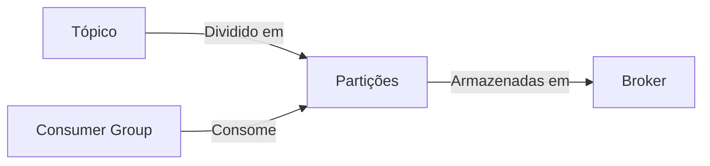
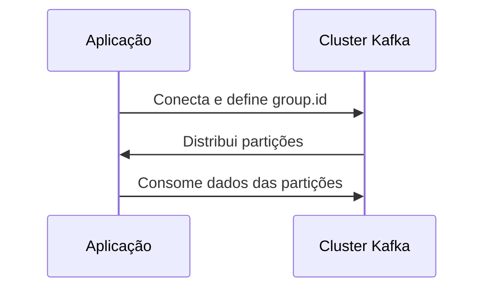
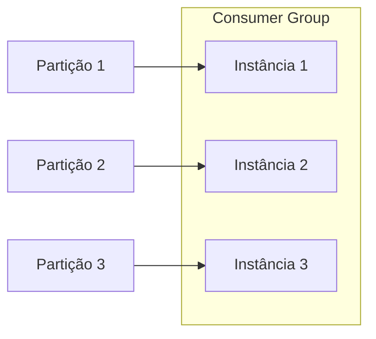
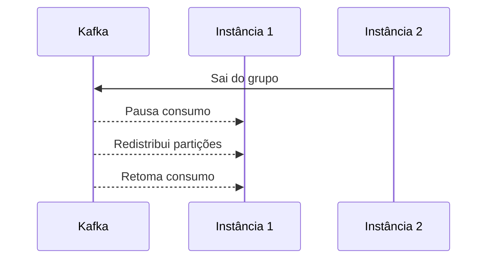
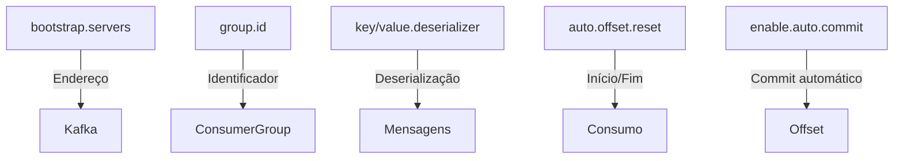
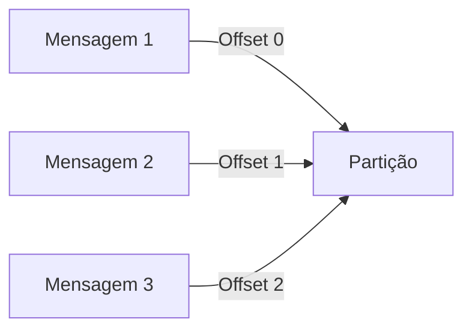
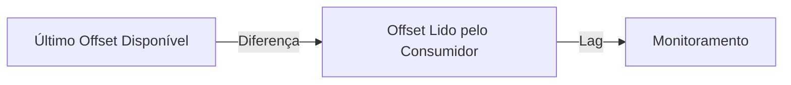
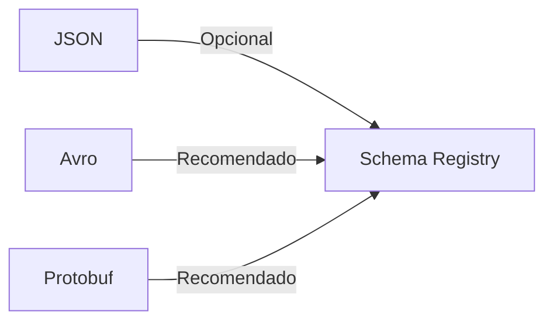
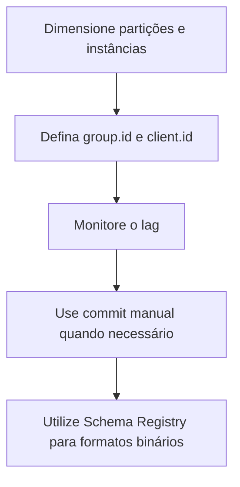
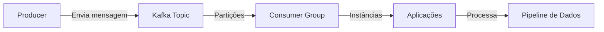

# Entrega de Dados com Apache Kafka: Guia Detalhado

## Introdução

Neste documento, exploramos o processo de consumo de dados no Apache Kafka, abordando conceitos fundamentais, práticas recomendadas e exemplos práticos com PySpark para pipelines reais.

---

## 1. Fundamentos do Consumo no Kafka

### 1.1. Conceitos Básicos



- **Tópico**: Canal lógico onde as mensagens são publicadas.
- **Partição**: Subdivisão de um tópico, permitindo paralelismo.
- **Broker**: Servidor Kafka responsável por armazenar dados.
- **Consumer Group**: Agrupamento de consumidores que trabalham juntos para ler dados de um tópico.

### 1.2. Como Funciona o Consumo



- A aplicação se conecta ao cluster Kafka e define um `group.id`.
- O Kafka distribui as partições entre as instâncias do grupo.
- Cada instância lê dados de uma ou mais partições.

**Importante:** Não existe consumidor sem `Consumer Group`. Se não for informado, o Kafka cria um automaticamente.

---

## 2. Consumer Groups e Partições

### 2.1. Distribuição de Partições



- Instâncias são distribuídas conforme o número de partições.
- Instâncias excedentes ficam ociosas; instâncias insuficientes consomem múltiplas partições.

### 2.2. Rebalanceamento



- O Kafka pausa o consumo, redistribui partições e retoma após o balanceamento.

**Atenção:** Adicionar/remover partições ou instâncias pode causar indisponibilidade temporária.

---

## 3. Configurações Essenciais do Consumer



- **bootstrap.servers**: Endereço dos brokers Kafka.
- **group.id**: Identificador do grupo de consumidores.
- **key.deserializer/value.deserializer**: Como deserializar as mensagens.
- **auto.offset.reset**: Define se começa a ler do início (`earliest`) ou do fim (`latest`).
- **enable.auto.commit**: Se o offset será comitado automaticamente.

---

## 4. Offset e Commit

### 4.1. O que é Offset?



- O **offset** é o identificador sequencial de cada mensagem dentro de uma partição.

### 4.2. Commit de Offset

- **Auto Commit**: O Kafka comita o offset automaticamente em intervalos.
- **Manual Commit**: A aplicação controla quando o offset é comitado.

#### Exemplo de Commit Manual em PySpark

```python
from pyspark.sql import SparkSession

spark = SparkSession.builder \
    .appName("KafkaConsumerExample") \
    .getOrCreate()

df = spark.readStream \
    .format("kafka") \
    .option("kafka.bootstrap.servers", "localhost:9092") \
    .option("subscribe", "meu-topico") \
    .option("startingOffsets", "earliest") \
    .load()

from pyspark.sql.functions import col
df = df.selectExpr("CAST(key AS STRING)", "CAST(value AS STRING)")

query = df.writeStream \
    .format("console") \
    .option("checkpointLocation", "/tmp/checkpoint") \
    .start()

query.awaitTermination()
```

> **Nota:** O Spark gerencia os commits de offset automaticamente via checkpoint.

---

## 5. Lag e Monitoramento



- **Lag**: Diferença entre o último offset disponível e o offset lido pelo consumidor.
- Lag alto pode indicar problemas de performance ou falhas no consumidor.

#### Exemplo de Monitoramento de Lag

```bash
kafka-consumer-groups.sh --bootstrap-server localhost:9092 --describe --group meu-consumer-group
```

---

## 6. Serialização e Schema Registry



- **JSON**: Não exige Schema Registry, mas pode ser usado para padronização.
- **Avro/Protobuf**: Recomendado usar Schema Registry para garantir compatibilidade e evolução de schemas.

#### Exemplo de Consumo de Avro com PySpark

```python
df = spark.readStream \
    .format("kafka") \
    .option("kafka.bootstrap.servers", "localhost:9092") \
    .option("subscribe", "meu-topico-avro") \
    .load()

from pyspark.sql.avro.functions import from_avro

avro_schema = '''
{
  "type": "record",
  "name": "Exemplo",
  "fields": [
    {"name": "id", "type": "int"},
    {"name": "valor", "type": "string"}
  ]
}
'''

df = df.withColumn("dados", from_avro(col("value"), avro_schema))
df.select("dados.*").writeStream.format("console").start().awaitTermination()
```

---

## 7. Boas Práticas



- Dimensione corretamente o número de partições e instâncias.
- Sempre defina `group.id` e `client.id`.
- Monitore o lag dos consumidores.
- Use commit manual para garantir processamento exato quando necessário.
- Utilize Schema Registry para formatos binários (Avro/Protobuf).

---

## 8. Resumo Visual



---

## 9. Conclusão

O consumo de dados no Kafka é altamente escalável e flexível, mas exige atenção ao gerenciamento de offsets, rebalanceamento e monitoramento de lag. Utilizando PySpark, é possível integrar o consumo de dados Kafka em pipelines robustos de processamento distribuído.

---

## 10. Referências

- [Documentação Oficial do Apache Kafka](https://kafka.apache.org/documentation/)
- [Structured Streaming + Kafka Integration Guide (PySpark)](https://spark.apache.org/docs/latest/structured-streaming-kafka-integration.html)
- [Confluent Schema Registry](https://docs.confluent.io/platform/current/schema-registry/index.html)

---