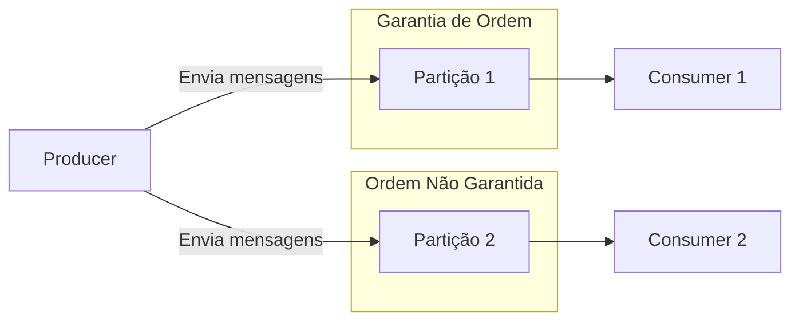
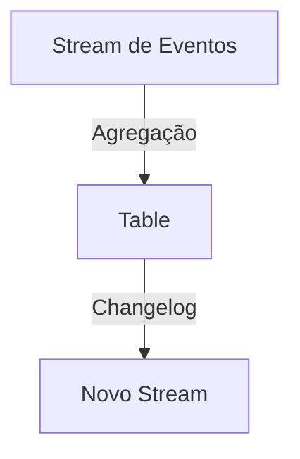
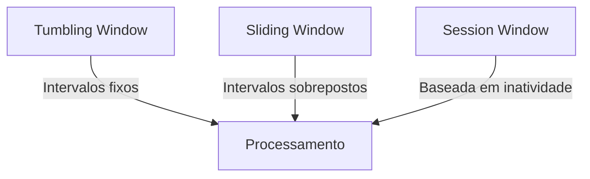
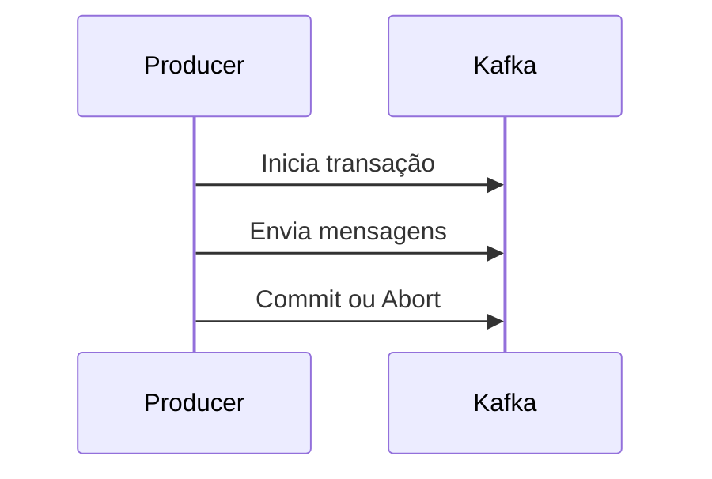
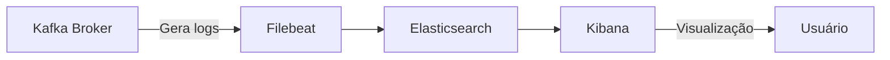
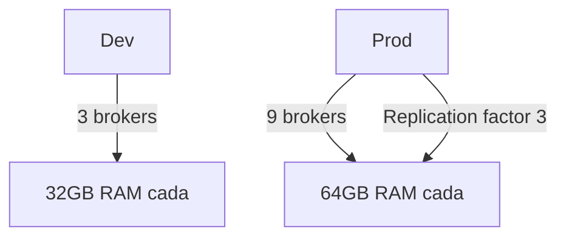
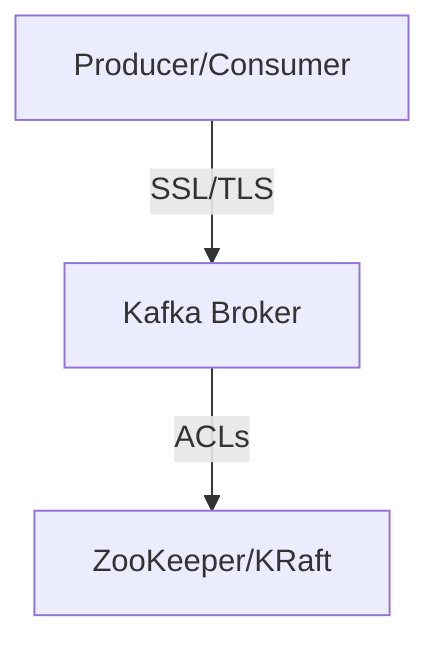
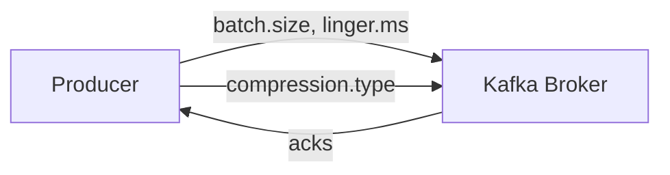
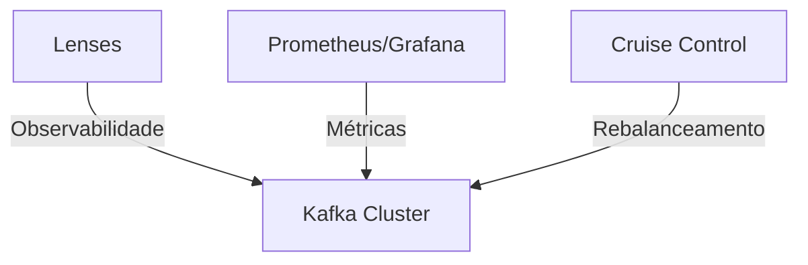
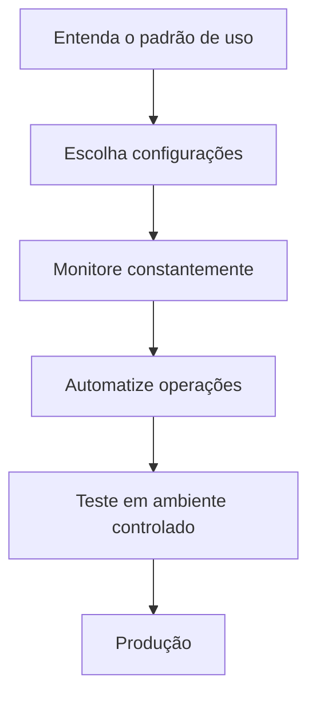

# Melhores Práticas em Apache Kafka: Guia Detalhado

Este documento apresenta um panorama aprofundado sobre melhores práticas no uso do Apache Kafka, abordando desde conceitos avançados de ordenação de mensagens, particionamento, processamento em streaming, janelas (windows), transações, logs, sizing, segurança, até estratégias de otimização de throughput e latência. Exemplos práticos em PySpark são incluídos para ilustrar a aplicação dos conceitos.

---

## 1. Ordenação de Mensagens e Particionamento

### Conceito

No Kafka, a ordenação de mensagens só é garantida dentro de uma mesma partição. Se você precisa de ordenação total, configure seu tópico com apenas **uma partição**. Caso contrário, ao usar múltiplas partições, a ordem entre mensagens pode ser perdida.



### Configurações Importantes

- **`max.in.flight.requests.per.connection`**: Controla quantas mensagens podem ser enviadas simultaneamente sem confirmação. Para garantir ordenação, mantenha este valor em 1.
- **`acks`**: Para maior durabilidade, use `acks=all`. Para maior throughput, `acks=1`.
- **`enable.idempotence`**: Habilite para evitar duplicidade de mensagens.

### Exemplo PySpark: Produção Ordenada

```python
from kafka import KafkaProducer

producer = KafkaProducer(
    bootstrap_servers='localhost:9092',
    acks='all',
    enable_idempotence=True,
    max_in_flight_requests_per_connection=1
)

for i in range(1, 9):
    producer.send('meu-topico', value=str(i).encode())
producer.flush()
```

---

## 2. Streams e Tables

### Diferença

- **Stream**: Fluxo imutável de eventos (append-only).
- **Table**: Estrutura mutável, representa o último estado de cada chave (semelhante a log-compaction).



### Conversão

- Streams podem ser agregados para formar Tables (ex: contagem, soma).
- Tables podem gerar Streams de mudanças (changelog).

### Exemplo PySpark: Agregação de Stream em Table

```python
from pyspark.sql import SparkSession
from pyspark.sql.functions import window, count

spark = SparkSession.builder.appName("KafkaStream").getOrCreate()

df = (
    spark.readStream
    .format("kafka")
    .option("kafka.bootstrap.servers", "localhost:9092")
    .option("subscribe", "meu-topico")
    .load()
)

from pyspark.sql.functions import from_json, col
from pyspark.sql.types import StructType, StringType

schema = StructType().add("usuario", StringType())

eventos = df.select(from_json(col("value").cast("string"), schema).alias("data")).select("data.*")

contagem = eventos.groupBy("usuario").count()

query = (
    contagem.writeStream
    .outputMode("complete")
    .format("console")
    .start()
)
query.awaitTermination()
```

---

## 3. Janelas de Processamento (Windows)

### Tipos de Janela



- **Session Window**: Baseada em inatividade (gap).
- **Hopping/Sliding Window**: Janelas sobrepostas.
- **Tumbling Window**: Janelas fixas, sem sobreposição.

### Exemplos PySpark

#### Tumbling Window

```python
from pyspark.sql.functions import window

janela = eventos.groupBy(window(col("timestamp"), "1 minute")).count()
```

#### Sliding Window

```python
janela = eventos.groupBy(window(col("timestamp"), "1 minute", "30 seconds")).count()
```

#### Session Window

PySpark não possui session window nativa, mas pode ser simulada com lógica adicional.

---

## 4. Transações no Kafka

### Quando Usar

Transações garantem que múltiplas operações de leitura/processamento/gravação sejam atômicas. Útil para pipelines críticos, mas adiciona complexidade e pode impactar performance (~3% de throughput).



### Fluxo Básico

1. Iniciar transação no producer.
2. Processar e enviar mensagens.
3. Comitar ou abortar transação.

### Exemplo PySpark

PySpark não suporta transações Kafka nativamente, mas pode ser implementado via API Java ou Python do Kafka.

---

## 5. Logs e Monitoramento



- **INFO e WARNING**: Mensagens informativas do Kafka são valiosas para troubleshooting.
- **Exportação de logs**: Use Filebeat + Elasticsearch + Kibana para centralizar e analisar logs.

---

## 6. Sizing e Infraestrutura

### Regras Gerais

- **Disco**: O recurso mais crítico. Monitore e alerte a partir de 70% de uso.
- **Memória**: Brokers exigem memória proporcional ao volume de dados e partições.
- **CPU**: Importante, mas menos crítico que disco.



---

## 7. Segurança



- **Autenticação**: SSL/TLS ou SASL.
- **Autorização**: ACLs no ZooKeeper (ou no controller, se usar KRaft).
- **ZeroCopy**: Habilitar SSL/TLS desabilita otimização de gravação ZeroCopy.

---

## 8. Otimização de Throughput e Latência



### Throughput

- Aumente `batch.size` e `linger.ms` no producer.
- Use compressão (`compression.type`).
- `acks=1` para maior velocidade.

### Latência

- Reduza `linger.ms` para 0.
- Desabilite compressão.
- `acks=1` para menor espera.

### Durabilidade

- `acks=all`, `enable.idempotence=true`, replication factor alto.
- Desabilite `auto.create.topics.enable`.
- Ajuste `min.insync.replicas` para garantir replicação.

---

## 9. Ferramentas de Observabilidade



- **Lenses**: Plataforma para desenvolvimento, troubleshooting e observabilidade de clusters Kafka.
- **Prometheus/Grafana**: Para métricas.
- **Cruise Control**: Para rebalanceamento automático de partições.

---

## 10. Exemplos Práticos em PySpark

### Consumo de Dados do Kafka

```python
df = (
    spark.readStream
    .format("kafka")
    .option("kafka.bootstrap.servers", "localhost:9092")
    .option("subscribe", "meu-topico")
    .load()
)
```

### Escrita em Tópico Kafka

```python
query = (
    df.selectExpr("CAST(key AS STRING)", "CAST(value AS STRING)")
    .writeStream
    .format("kafka")
    .option("kafka.bootstrap.servers", "localhost:9092")
    .option("topic", "topico-destino")
    .option("checkpointLocation", "/tmp/checkpoint")
    .start()
)
query.awaitTermination()
```

---

## 11. Recomendações Finais



- **Entenda o padrão de uso**: Escolha configurações conforme o caso de uso (latência, throughput, durabilidade).
- **Monitore constantemente**: Logs, métricas e uso de recursos.
- **Automatize operações administrativas**: Use ferramentas como Cruise Control.
- **Teste configurações em ambiente controlado** antes de aplicar em produção.

---

Este guia serve como referência para arquitetar, operar e otimizar ambientes Kafka, com exemplos práticos para aplicação em PySpark. Adapte as recomendações conforme a necessidade do seu projeto e mantenha-se atualizado com as melhores práticas da comunidade.
