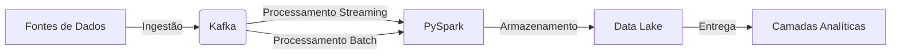
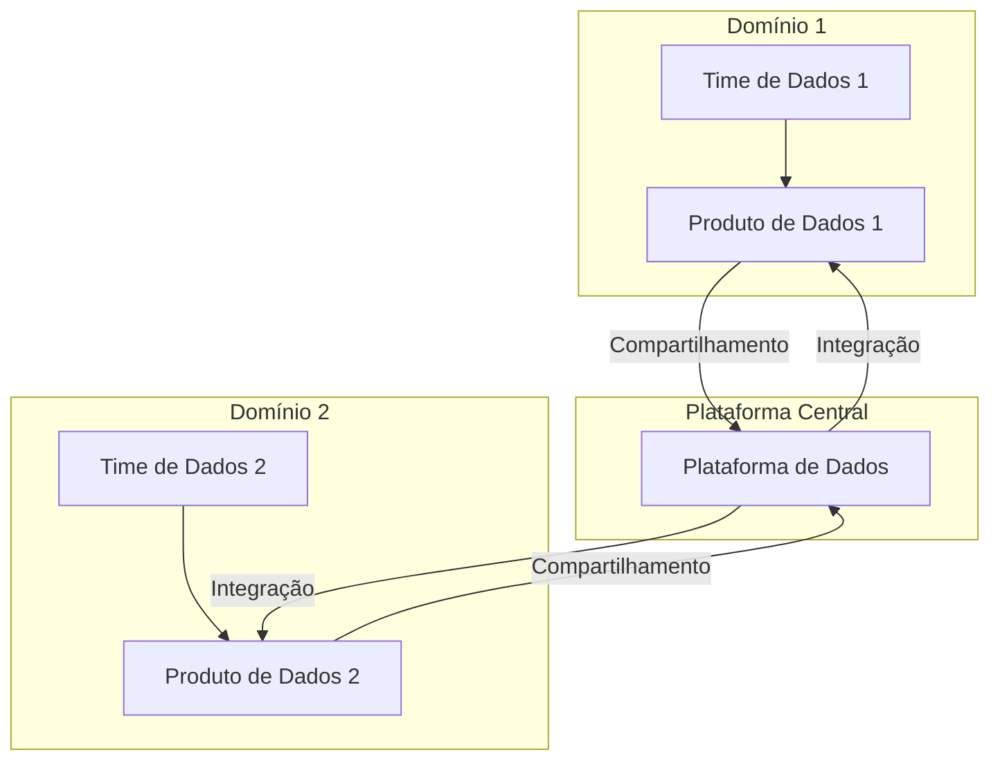
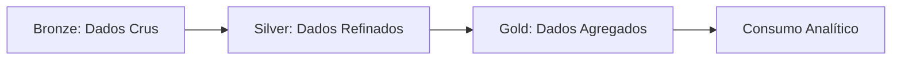

# Arquiteturas Modernas de Dados: Conceitos, Práticas e Exemplos com PySpark

Este documento apresenta uma explicação detalhada sobre as principais arquiteturas de dados modernas, como Kappa, Data Mesh, Lakehouse e Stream House, além de abordar práticas recomendadas para processamento de dados, qualidade, mascaramento e integração com Apache Kafka. Exemplos práticos em PySpark são fornecidos para ilustrar conceitos e aplicações.

---

## 1. Arquitetura Kappa

A arquitetura Kappa foi desenvolvida por Jay Kreps, criador do Apache Kafka, com o objetivo de simplificar o processamento de dados, unificando ingestão batch e streaming em um único fluxo.

### Diagrama de Fluxo Kappa



### Características

- **Ingestão Unificada:** Todas as fontes de dados (arquivos, bancos, aplicações) enviam dados para um único ponto central, geralmente o Kafka.
- **Processamento Flexível:** Os dados podem ser processados em tempo real (streaming) ou em lote (batch), conforme a necessidade.
- **Armazenamento Histórico:** Utiliza-se um Data Lake para armazenar dados históricos, permitindo reprocessamento quando necessário.
- **Entrega:** Após o processamento, os dados são disponibilizados em camadas analíticas, como Data Warehouse ou ferramentas de visualização.

### Exemplo de Pipeline com PySpark

```python
from pyspark.sql import SparkSession
from pyspark.sql.functions import col

spark = SparkSession.builder.appName("KappaArchitecture").getOrCreate()

df_stream = spark.readStream.format("kafka") \
    .option("kafka.bootstrap.servers", "localhost:9092") \
    .option("subscribe", "meu-topico") \
    .load()

df_stream = df_stream.selectExpr("CAST(value AS STRING) as json")
df_processed = df_stream.filter(col("json").isNotNull())

query = df_processed.writeStream \
    .format("parquet") \
    .option("path", "/data/historico") \
    .option("checkpointLocation", "/data/checkpoints") \
    .start()
```

---

## 2. Data Mesh

O Data Mesh propõe a descentralização da responsabilidade dos dados, criando domínios de dados gerenciados por times de negócio.

### Diagrama Data Mesh



### Características

- **Domínios de Dados:** Cada área de negócio possui seu próprio time de dados, responsável por criar, processar e disponibilizar produtos de dados.
- **Plataforma de Dados:** Uma plataforma centralizada facilita a integração e o compartilhamento entre domínios.
- **Cultura Organizacional:** O sucesso do Data Mesh depende de mudanças culturais e organizacionais.

### Exemplo de Criação de Domínio com PySpark

```python
df_cliente = spark.read.parquet("/data/bronze/clientes")
df_cliente_silver = df_cliente.filter(col("ativo") == True)
df_cliente_silver.write.parquet("/data/silver/clientes")
```

---

## 3. Lakehouse

O Lakehouse combina as vantagens do Data Lake (armazenamento flexível e barato) com as do Data Warehouse (transações ACID, performance analítica).

### Diagrama de Camadas Lakehouse



### Camadas

- **Bronze:** Dados crus, ingestão direta da fonte.
- **Silver:** Dados refinados, tratados e padronizados.
- **Gold:** Dados agregados, prontos para consumo analítico.

### Exemplo de Pipeline Lakehouse com PySpark

```python
df_bronze = spark.read.json("/data/raw/usuarios.json")
df_bronze.write.parquet("/data/bronze/usuarios")

df_silver = df_bronze.dropDuplicates(["id"]).filter(col("email").isNotNull())
df_silver.write.parquet("/data/silver/usuarios")

df_gold = df_silver.groupBy("cidade").count()
df_gold.write.parquet("/data/gold/usuarios_por_cidade")
```

---

## 4. Stream House

A Stream House utiliza tecnologias como Apache Flink e Apache Paimon para habilitar processamento analítico em tempo real sobre dados armazenados em formato Lakehouse.

### Diagrama de Pipeline Stream House


### Características

- **Processamento em Tempo Real:** Pipelines de streaming com granularidade de tabelas (ODS, DWD, DWS, ADS).
- **Integração com Flink/Spark:** Uso de conectores CDC para ingestão de dados de bancos relacionais.

### Exemplo de Pipeline ODS → DWD → DWS → ADS com PySpark

```python
df_ods = spark.read.parquet("/data/ods/transacoes")
df_dwd = df_ods.withColumn("valor_com_imposto", col("valor") * 1.1)
df_dwd.write.parquet("/data/dwd/transacoes")

df_dws = df_dwd.groupBy("data").sum("valor_com_imposto")
df_dws.write.parquet("/data/dws/transacoes_diarias")

df_ads = df_dws.filter(col("sum(valor_com_imposto)") > 1000)
df_ads.write.parquet("/data/ads/transacoes_relevantes")
```

---

## 5. Práticas de LGPD e Mascaramento de Dados

A Lei Geral de Proteção de Dados (LGPD) exige o tratamento adequado de dados pessoais. O mascaramento pode ser feito na camada de processamento, garantindo que apenas dados processados sejam acessíveis.

### Diagrama de Mascaramento


### Exemplo de Mascaramento de Dados com PySpark

```python
from pyspark.sql.functions import regexp_replace

df_mascarado = df_silver.withColumn(
    "email_mascarado",
    regexp_replace(col("email"), r"(^.).*(@.*$)", r"\1***\2")
)
df_mascarado.write.parquet("/data/silver/usuarios_mascarados")
```

---

## 6. Data Quality e Validação

Garantir a qualidade dos dados é fundamental. Ferramentas como Great Expectations ou Soda podem ser integradas, mas também é possível implementar validações simples em PySpark.

### Diagrama de Validação


### Exemplo de Validação de Dados

```python
df_validado = df_silver.filter(col("cpf").isNotNull())
df_validado = df_validado.filter(col("idade") > 18)
```

---

## 7. Integração com Kafka e Testes

O Apache Kafka permite ingestão e processamento de dados em tempo real. Testes podem ser realizados no nível do producer para garantir a conformidade dos dados enviados.

### Diagrama de Integração Kafka


### Exemplo de Envio de Dados Validados para Kafka

```python
from pyspark.sql.functions import to_json, struct

df_to_kafka = df_validado.select(to_json(struct("*")).alias("value"))

df_to_kafka.write \
    .format("kafka") \
    .option("kafka.bootstrap.servers", "localhost:9092") \
    .option("topic", "usuarios-validados") \
    .save()
```

---

## 8. Considerações Finais

- **Organização dos Dados:** Estruture pipelines em camadas (bronze, silver, gold) para facilitar governança e qualidade.
- **Automação e Monitoramento:** Utilize ferramentas de orquestração (Airflow) e monitoramento (OpenSearch, New Relic, Lensys) para garantir confiabilidade.
- **Colaboração:** Compartilhe produtos de dados entre domínios e incentive a cultura de dados na organização.

---

## 9. Referências

- [Apache Kafka Documentation](https://kafka.apache.org/documentation/)
- [PySpark Documentation](https://spark.apache.org/docs/latest/api/python/)
- [Great Expectations](https://greatexpectations.io/)
- [Soda Data](https://soda.io/)
- [Apache Flink](https://flink.apache.org/)
- [Apache Paimon](https://paimon.apache.org/)

---

Este documento serve como guia introdutório e prático para arquiteturas modernas de dados, com exemplos aplicáveis em PySpark para facilitar a adoção e o entendimento dos conceitos apresentados.
